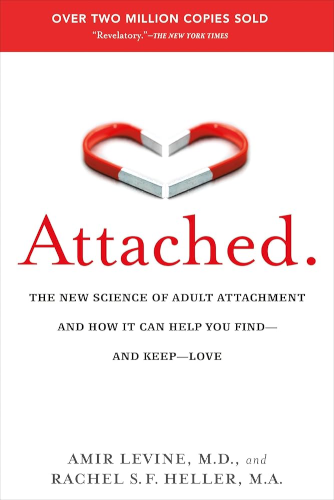

# Attached

By Amir Levine and Rachel S.F. Heller

*Attached* provides a very actionable guide to having successful and fulfilling relationships, walking through the science and advice distilled from a large amount of research on attachment. The book describes three main attachment styles, helps you figure out which one you are, outlines ways to figure out which one someone else is, and then provides guidance on how best to navigate your interactions based on these attachment styles.

I find this book very compelling, because it provides concrete examples (stories from people's lives) that demonstrate how real these attachment styles are. The stories illustrate how powerful it can be to calibrate one's behavior just a little bit based on a few very simple bits of knowledge.

For example, if you're an avoidant-type and your partner is an anxious-type, you're not going to get more space if you push the other person away. This will just trigger their anxious attachment style, which will make them try to be even closer. The best way to get what you need is to provide just a little bit of closeness – this will make the other person feel comfortable, and happy to let you be in your own space for a while.

### Sparks

The book discusses a study in which women received a mild electric shock, under three conditions: alone, while holding a stranger's hand, and while holding their husband's hand. The hypothalamus's reaction to the shock was the greatest in those who were alone, and the least in those who were holding their husband's hand.

> Furthermore, the women who benefited most from spousal hand-holding were those who reported the highest marital satisfaction.
>
> The study demonstrates that when two people form an intimate relationship, they regulate each other's psychological and emotional well-being. Their physical proximity and availability influence the stress response.
>
> [27]

 

### Attachment Styles

> Adult attachment designates three main "attachment styles", or manners in which people perceive and respond to intimacy in romantic relationships, which parallel those found in children: Secure, Anxious, and Avoidant. Basically, *secure* people feel comfortable with intimacy and are usually warm and loving; *anxious* people crave intimacy, and tend to worry about their partner's ability to love them back; *avoidant* people equate intimacy with a loss of independence and constantly try to minimize closeness.
>
> [8]

 

> Most people are only as needy as their unmet needs. When their emotional needs are met, and the earlier the better, they usually turn their attention outward. This is sometimes referred to in attachment literature as the "dependency paradox": The more effectively dependent people are on one another, the more independent and daring they become.
>
> [21]

 

If there's one part of the book everyone should study carefully, it's page 44. This page outlines the characterizations of each attachment style. As you're reading this, note that there are positives to every style.

> **Anxious**: You love to be very close to your romantic partners and have the capacity for great intimacy. You often fear, however, that your partner does not wish to be as close as you would like them to be. Relationships tend to consume a large part of your emotional energy. You tend to be very sensitive to small fluctuations in your partner's moods and actions, and although your sense are often accurate, you take your partner's behaviors too personally. You experience a lot of negative emotions within the relationship and get easily upset. As a result, you tend to act out and say things you later regret. If the other person provides a lot of security and reassurance, however, you are able to shed much of your preoccupation and feel contended.
>
> **Avoidant**: It is very important for you to maintain your independence and self-sufficiency and you often prefer autonomy to intimate relationships. Even though you do want to be close to others, you feel uncomfortable with too much closeness and tend to keep your partner and arm's length. You don't spend much time worrying about your romantic relationships or about being rejected. You tend not to open up to your partners and they often complain that you are emotionally distant. In relationships, you are often on high alert for any signs of control or impingement on your territory by your partner.
>
> **Secure**: Being warm and loving in a relationship comes naturally to you. You enjoy being intimate without becoming overly worried about your relationships. You take things in stride when it comes to romance and don't get easily upset over relationship matters. You effectively communicate your needs and feelings to your partner and are strong at reading your partner's emotional cues and responding to them. You share your successes and problems with your mate, and are able to be there for them in times of need.
>
> [44]

I'd suggest everyone should figure out which attachment style (or mixture of styles) they are. For example, I might be secure with a sprinkle of avoidant. There's a quiz on pages 40-43 that can help you determine your attachment style. You can also just read these paragraphs and see which descriptions most closely align with your behavior in recent or current relationships.

Once you know your style, carefully read the corresponding paragraph above, and then think about what types of things you might naturally do in relationships that would upset your partner. How could you calibrate your behavior to make the relationship better for both you and your partner?

As an added bonus, if you are in a relationship, or whenever you enter a new relationship, figure out your partner's attachment style and study the paragraph for their style as well. Based on this information, what could you do to make them feel more comfortable and satisfied in the relationship?

 

---

 

On pages 52-59, the book outlines characteristic behaviors that you can use to help identify others' attachment styles:

> **Anxious**
>
> - Wants a lot of closeness in the relationship.
> - Expresses insecurities – worries about rejection.
> - Unhappy when not in a relationship.
> - Plays games to keep your attention/interest.
> - Has difficulty explaining what's bothering them. Expects you to guess.
> - Acts out – instead of trying to resolve the problem between you.
> - Has a hard time *not* making things about themself in the relationship.
> - Lets you set the tone of the relationship so as not to get hurt.
> - Is preoccupied with the relationship.
> - Fears that small acts will ruin the relationship; believes they must work hard to keep your interest.
> - Suspicious that you may be unfaithful.
>
>  
>
> **Avoidant**
>
> - Sends mixed signals.
> - Values their independence greatly.
> - Devalues you.
> - Uses distancing strategies – emotional or physical.
> - Emphasizes boundaries in the relationship.
> - Has an unrealistically romantic view of how a relationship should be.
> - Mistrustful – fears being taken advantage of by their partner.
> - Has rigid view of relationships and uncompromising rules.
> - During a disagreement, needs to get away or "explodes".
> - Doesn't make their intentions clear – leaves you guessing as to their feelings.
> - Has difficulty talking about what's going on between you.
>
>  
>
> **Secure**
>
> - Reliable and consistent.
> - Makes decisions with you.
> - Flexible in view of relationships.
> - Communicates relationship issues well.
> - Can reach compromise during arguments.
> - Not afraid of commitment or dependency.
> - Doesn't view relationships as hard work.
> - Closeness creates further closeness.
> - Introduces friends and family early on.
> - Naturally expresses feelings for you.
> - Doesn't play games.

 

### The Anxious Attachment System

> **You're only as troubled as the relationship you're in.**
>
> In the beginning, Emily was doing very well. In fact, she appeared so put together that her analyst thought that she would be done with the analysis within two years max – unheard of, considering that analysis usually lasts at least four to five years.
>
> Then she met David, whom she fell for very quickly. David, an aspiring actor, turned out to be bad news. He gave her mixed signals about wanting to be together [characteristic avoidant behavior], and this really unnerved Emily. It changed her behavior until she appeared to have completely destabilized.
>
> Her analyst could not make sense of this horrible transformation in his most promising candidate. From a resilient, together person, Emily began to change into someone with "masochistic borderline personality traits".
>
> [77]

The problem may not be your inherent psychology. It may be your relationships.

Personally, I went from the most deeply depressed state of my life to one of the happiest phases of my life, simply by switching the people I interacted with.

 

> People with an anxious attachment style like Emily have a super-sensitive *attachment system*. If you have an anxious attachment style, you possess a unique ability to sense when your relationship is threatened. Even a slight hint that something may be wrong will activate your attachment system, and once it's activated, you are unable to calm down until you get a clear indication from your partner that they are truly there for you and that the relationship is safe.
>
> [79]

 

> These findings suggest that people with an anxious attachment style are indeed more vigilant to changes in others' emotional expression. However, this finding comes with a caveat. The study showed that people with an anxious attachment style tend to jump to conclusions very quickly, and when they do, they tend to misinterpret people's emotional state.
>
> [80]

 

> Once activated, [people with anxious attachment styles] are often consumed with thoguhts that have a single purpose: to reestablish closeness with their partner. These thoughts are called *activating strategies*.
>
> [80]

There is a list of activating strategies on page 81, which could be very valuable for anyone with an anxious attachment style, or who may be in a relationship with such a person.

 

> *Protest behavior* is any action that tries to reestablish contact with your partner and get their attention.
>
> Protest behavior and activating strategies can cause you to act in ways that are harmful to the relationship. It is very important to learn to recognize them when they happen.
>
> [88]

See pages 86-87 for a full outline of protest behavior categories and examples. The categories are:

> **Protest Behavior**
>
> - Excessive attempts to reestablish contact
> - Withdrawing
> - Keeping score
> - Acting hostile
> - Threatening to leave
> - Manipulations
> - Making them feel jealous
>
> [86]

 

> **If You're Anxious, You Shouldn't Be Dating Someone Avoidant Because:**
>
> | | |
> | --- | --- |
> | **You**: want closeness and intimacy. | **They**: want to maintain some distance. |
> | **You**: are very sensitive to any signs of rejection. | **They**: send mixed signals that often come across as rejecting. |
> | **You**: find it hard to tell them directly what you need and what's bothering you. | **They**: are bad at reading your verbal and nonverbal cues and don't think it's their responsibility to do so. |
> | **You**: need to be reassured and feel loved. | **They**: tend to put you down to create distance as a means to deactivate their attachment system. |
> | **You**: need to know exactly where you stand in the relationship. | **They**: prefer to keep things fuzzy. Even if your relationship is very serious, some question marks still remain. |
>
> [93]

Also see **If You're Anxious, You *Should* Be Dating Someone Secure Because** on page 97.

 

> **Give secure people a chance.**
>
> Once you've recognized someone you've met as secure, remember not to make impulsive decisions about whether they are right for you. Remind yourself that you might feel bored at first – after all, there is less drama when your attachment system isn't activated. Give it some time. Chances are, if you are anxious, you will automatically interpret calmness in the relationship as a lack of attraction. But if you hold out a little longer, you may start to appreciate a calm attachment system and all the advantages it has to offer.
>
> [107]

 

## The Avoidant Attachment System

> Distracted by another task, [the avoidants'] ability to repress lessened and their true attachment feelings and concerns were able to surface.
>
> The experiments show that although you may be avoidant, your attachment "machinery" is still in place. Only when your mental energy is needed elsewhere and you are caught off guard, however, do these emotions and feelings emerge.
>
> These studies also tell us that avoidants such as Susan aren't such free spirits after all; it is the defensive stance that they adopt that makes them *seem* that way.
>
> [114]

 

On page 116, the book introduces the idea of *deactivating strategies*, defined as "any behavior or thought that is used to squelch intimacy". This is the avoidant analog to the anxious peron's *activating strategies*.

If you have an avoidant attachment style, or are in a relationship with such a person, you will likely find the list of deactivating strategies on page 117 very helpful.

 

> **Coaching Session: Eight Things You Can Start Doing Today to Stop Pushing Love Away**
>
> 1. Learn to identify deactivating strategies.
> 2. De-emphasize self-reliance and focus on mutual support.
> 3. Find a secure partner.
> 4. Be aware of your tendency to misinterpret behaviors.
> 5. Make a relationship gratitude list.
> 6. Nix the phantom ex.
> 7. Forget about "the one".
> 8. Adopt the distraction strategy.
>
> [130]

 

## The Secure Attachment Style

> So not only do people with a secure attachment style fare better in relationships, they also create a buffering effect, somehow managing to raise their insecure partner's relationship satisfaction and functioning to their own high level.
>
> If you're with someone secure, they nurture you into a more secure stance.
>
> [133]

 

> [People with a secure attachment style] are programmed to expect their partners to be loving and responsive and don't worry much about losing their partner's love. They feel extremely comfortable with intimacy and closeness and have an uncanny ability to communicate their needs and respond to their partner's needs.
>
> [135]

 

> **Tapping Into the Secure Mind-set – Creating a Secure Base for Your Partner**
>
> One of the most important roles we place in our partners' lives is providing a secure base: creating the conditions that enable our partners to pursue their interests and explore the world in confidence.
>
> [141]

 

> **Examples of Secure Principles**
>
> - Be available.
> - Don't interfere.
> - Act encouragingly.
> - Communicate effectively.
> - Don't play games.
> - View yourself as responsible for your partner's well-being.
> - Wear your heart on your sleeve – be courageous and honest in your intentions.
> - Maintain focus on the problem at hand.
> - Don't make generalizations during conflict.
> - Douse the flame before it becomes a forest fire – attend to your partner's upsets before they escalate.
>
> [174]

 

> **The Five Principles of Effective Communication**
>
> 1. Wear your heart on your sleeve. Be emotionally brave!
> 2. Focus on your needs.
> 3. Be specific.
> 4. Don't blame. Never make your partner feel selfish, incompetent, or inadequate.
> 5. Be assertive and nonapologetic. Your relationship needs are valid – period.
>
> [235]

 

## Breakups

> **Surviving a Breakup**
>
> 1. [When deciding whether to break up...] Ask yourself what life is like for you in the "inner circle". [How are you treated when no one else is around?]
> 2. Build a support network *ahead of time*.
> 3. Find a comforting, supportive place to stay for the first few nights.
> 4. Get your attachment needs met in other ways.
> 5. Don't be ashamed if you slip up and go back to "the scene of the crime".
> 6. If you're having a hard time, don't feel guilty. Remember, the pain is real!
> 7. When you get flooded with positive memories, ask a close friend for a reality check.
> 8. Deactivate: Write down all the reasons you wanted to leave.
> 9. Know that no matter how much pain you're going through now, it will pass.
>
> [215]

 

## Epilogue

> The first misconception is that everyone has the same capacity for intimacy.
>
> In fact, people have very different capacities for intimacy.
>
> [270]

 

> Mismatched attachment styles can lead to a great deal of unhappiness in marriage, even for people who love each other greatly.
>
> [270]

 

> In a true partnership, both partners view it as their responsibility to ensure the other's emotional well-being.
>
> [271]

 

> Above all, remain true to your authentic self – playing games will only distance you from your ultimate goal of finding true happiness, be it with your current partner or with someone else.
>
> [272]

 

---

 

Return to the [Book List](Readme.md#book-list).