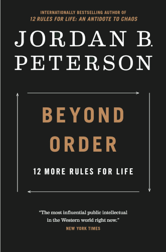

# Beyond Order: 12 More Rules for Life

By Jordan B. Peterson

Jordan Peterson may be the most rigorous and precise thinker and communicator I have ever been exposed to. I am certain he would have been a world-class mathematician or theoretical computer scientist, had he chosen to pursue those fields.

Instead, he chose to dedicate his life to interacting with and observing people, and studying the human psyche. The wisdom he has extracted from this experience is unparalleled, and the way he writes offers a window into a manner of thinking most of us would not have even considered possible without having seen it firsthand.

I think everyone should read at least one Jordan Peterson book in their life, and this one might be his best. (The prequel, *12 Rules for Life*, is also fantastic, and perhaps slightly more immediately practical for the average person than this one.)

### Sparks

> I can tell you what has saved me, so far — [...] the fact that I still had meaningful work I could struggle through while in the abyss.
>
> [xxiii]

 

#### Rule I: Do not carelessly denigrate social institutions or creative achievement.

 

> People depend on constant communication with others to keep their minds organized. We all need to think to keep things straight, but we mostly think by talking.
>
> [3]

 

> We outsource the problem of sanity. People remain mentally healthy because they are constantly being reminded how to think, act, and speak by those around them.
>
> [5]

 

> We compete for attention, personally, socially, and economically. No currency has a value that exceeds it.
>
> [7]

It is my theory that as technology advances and more and more things become automated, one thing will rise up as the supreme currency of the utmost value: human attention.

Even today we already see that businesses are centered around capturing your attention, and the monetary value of something is generally in direct correlation with the amount of human attention it receives.

 

> It is useful to take your place at the bottom of a hierarchy. It can aid in the development of gratitude and humility.
>
> *Gratitude*: There are people whose expertise exceeds your own, and you should be wisely pleased about that.
>
> *Humility*: It is better to presume ignorance and invite learning than to assume sufficient knowledge and risk the consequent blindness.
>
> [17]

 

> It is said, with much truth, that genuine communication can take place only between peers. This is because it is very difficult to move information up a hierarchy.
>
> [21]

 

> A certain amount of arbitrary rule-ness must be tolerated — or welcomed, depending on your point of view — to keep the world and its inhabitants together. A certain amount of creativity and rebellion must be tolerated — or welcomed, depending on your point of view — to maintain the process of regeneration.
>
> [47]

 

#### Rule II: Imagine who you could be, and then aim single-mindedly at that.

 

> You do not choose what interests you. It chooses you.
>
> [65]

 

I take this to mean: don't waste your time *trying* to be interested in something you're not. Find what calls to you and pursue that.

 

#### Rule III: Do not hide unwanted things in the fog.

 

> [On facing problems, even if they involve uncomfortable conversations...]
>
> Do not pretend that you are happy with something if you are not. Have the damn fight.
>
> And that is particularly true for those daily events that everyone is prone to regard as trivial.
>
> Life is what repeats, and it is worth getting what repeats right.
>
> [91]

 

> Instead, she let him have is way, repeatedly, increment by increment, because she claimed that such trivialities were not worth fighting for. And with each defeat the next disagreement became more necessary — although less likely, because she understood that a serious discussion, once initiated, risked expanding to include all the things that were troublesome about her marriage, and that a real, no-holds-barred battle would therefore likely ensure.
>
> [93]

 

> It also opens the door to another kind of faith in humanity: one based on courage, rather than naivete. I will trust you — I will extend my hand to you — despite the risk of betrayal, because it is possible, through trust, to bring out the best in you, and perhaps in me.
>
> [103]

Perhaps one of the most deeply powerful passages I've read in a long time. All I can say is: Yes! That is a beautiful idea, let's all do that (with some amount of discretion of course).

 

#### Rule IV: Notice that opportunity lurks where responsibility has been abdicated.

 

> It is a maxim of clinical intervention that **voluntary** confrontation with a feared, hated, or despised obstacle is curative.
>
> [121]

 

> But for a time evil can be overcome, banished, and defeated. Then peace and harmony can prevail for as long as people do not forget what brought them both about.
>
> [122]

 

> "What is a truly reliable source of positive emotion?"
>
> People experience positive emotion in relationship to the *pursuit* of a valuable goal. Imagine you have a goal. You aim at something. You develop a strategy in relationship to that aim, and then you implement it. And then, as you implement the strategy, you observe that it is working. *That* is what produces the most reliably positive emotion.
>
> [129]

 

> A bricklayer may question the utility of laying his bricks, monotonously, one after another. But perhaps he is not merely laying bricks. Maybe he is building a wall. And the wall is part of a building. And the building is a cathedral. And the purpose of the cathedral is the glorification of the Highest Good. And under such circumstances, every brick laid is an act that partakes of the divine.
>
> [134]

*We who cut mere stones must always be envisioning cathedrals.* —Quarry Worker's Creed

 

#### Rule V: Do not do what you hate.

 

> I believe that the good that people do, small though it may appear, has more to do with the good that manifests broadly in the world than people think, and I believe the same about evil. We are each more responsible for the state of the world than we believe.
>
> [147]

 

#### Rule VI: Abandon ideology.

 

> Beware of blanket univariate (single variable) causes for diverse, complex problems.
>
> [174]

 

#### Rule VII: Work as hard as you can on at least one thing and see what happens.

 

> Without clear, well-defined, and non-contradictory goals, the sense of positive engagement that makes life worthwhile is very difficult to obtain. Clear goals limit and simplify the world as well, reducing uncertainty, anxiety, shame, and the self-devouring physiological forces unleashed by stress.
>
> [183]

 

> Those who do not choose a direction are lost. It is far better to become something than to remain anything but become nothing.
>
> [188]

 

#### Rule VIII: Try to make one room in your home as beautiful as possible.

 

> Making something beautiful is difficult, but it is amazingly worthwhile. If you learn to make something in your life truly beautiful — even one thing — then you have established a relationship with beauty.
>
> [202]

 

> Why cannot every small town have a shrine devoted to one great piece of art, instead of having every piece collected in a manner impossible for anyone ever to take in at once?
>
> [211]

 

> Artists are the people who stand on the frontier of the transformation of the unknown into knowledge.
>
> [214]

 

#### Rule IX: If old memories still upset you, write them down carefully and completely.

 

> It is a psychological truism that anything sufficiently threatening or harmful once encountered can never be forgotten if it has never been understood.
>
> [231]

This makes perfect sense. For the purpose of safety, the brain has to hold onto this event until it can produce an explanation that integrates it into its existing models of the world — at which point the event itself is superfluous and can safely be discarded.

 

#### Rule X: Plan and work diligently to maintain the romance in your relationship

 

> Trust in turn trumps cynicism, and true trust is not naivete. Trust between people who are not naive is a form of courage, because betrayal is always a possibility, and because this is consciously understood.
>
> [271]

 

> But you can be certain, you want-to-be tyrants, that your slaves will take their revenge where they can, even if that means merely being much less than they could be.
>
> [278]

 

> Do not confuse "nice" with "good".
>
> [281]

 

> There are things you do together that are mundane things; those things you do every day. But they are your whole life. You get those things right and you have established yourself much more effectively than you  might realize.
>
> [293]

 

> It is a fortunate happenstance, generally speaking, that your idiosyncrasies are likely to be somewhat randomly distributed, and that if you unite with someone else you are likely to find some strength where you are weak and vice versa. When you unite the two of you to recreate that original divine being — that is the symbolic idea — then you have a chance of producing one reasonable, sane being.
>
> [294]

 

> Here is a rule: do not ever punish your partner for doing something you want them to continue doing. Particularly if it took some real courage to manage.
>
> [299]

 

#### Rule XI: Do not allow yourself to become resentful, deceitful, or arrogant.

 

> The triad of resentment, deceit, and arrogance is as good a decomposition of what constitutes evil as I have been able to formulate.
>
> [303]

 

> It is difficult for any of us to see what we are blinded to by the nature of our personalities. It is for this reason that we must continually listen to people who differ from us, and who, because of that difference, have the ability to see and to react appropriately to what we cannot detect.
>
> [333]

 

> The nihilistic attitude is a judgment, a conclusion — and it is a sin of pride, in my estimation. I think we are properly bounded in humility by a reasonable sense of our own ignorance not to take the terrible risk of damning the structure of existence itself.
>
> [347]

 

#### Rule XII: Be grateful in spite of your suffering.

 

> I have been searching for decades for certainty.
It has not been solely a matter of thinking, in the creative sense, but of thinking and then attempting to undermine and destroy the resultant thoughts, followed by careful consideration and conservation of those that survive.
>
> [355]

 

> It is easy for optimism to be undermined and demolished, however, if it is naive, and for cynicism to arise in its place. But the act of peering into the darkness as deeply as possible reveals a light that appears unquenchable, and that is a profound surprise, as well as a great relief.
>
> [357]

 

---

 

Return to the [Book List](Readme.md#book-list).
