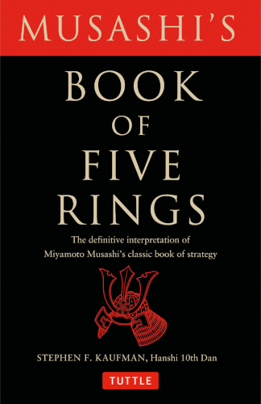

# The Book of Five Rings

By Miyamoto Musashi

Translated by Stephen F. Kaufman

Miyamoto Musashi was a Japanese samurai who won over 60 duels to the death and then retired. Even for a Japanese samurai, this number is outrageous — the next highest number is half this. This book is a unique opportunity to be exposed directly to the thoughts and words of someone of such unique accomplishment.

On one level, the book is about swordsmanship. But if you see the meaning behind the words, it is really about a way of life. A life of focus, dedication, mastery, letting go of the ego, avoiding all the general nonsense of life, and accomplishing one's goals. It's amazing how, from someone whose life would seem so removed from our own, his words speak so powerfully and incisively to us.

If you are interested by the ideas of Miyamoto Musashi, I highly encourage you to also check out his [*Dokkodo*](https://en.wikipedia.org/wiki/Dokk%C5%8Dd%C5%8D).

### Sparks

> Once a specific technique has been understood, the warrior stops using it on a conscious level because in combat having a conscious identity imposes limitations.
>
> [xi]

 

> There can be no let up to your study, regardless of the path you choose, even though you may have mastered a particular level. You must search constantly for still more understanding of your chosen art.
>
> [7]

 

> To know then thousand things, know one well.
>
> [13]

 

> When you reread this book you will see another level of understanding come to light. In fact, each time you pick the book up to study it again, you will interpret the teachings differently. This does not mean that your previous understanding was wrong. It simply means that you are proceeding to ask the "spirit of the thing" to reveal itself on a higher level.
>
> [25]

 

> You should always train with timing and rhythm uppermost in your mind, and realize that there are different types of timing and different types of rhythm.
>
> [19]

 

> Imitation is the surest form of flattery and failure.
>
> [26]

 

> You must fight with the attitude of no-mind. Do not think of possible outcomes until you have finished with your battle. To do so is foolish and takes your mind off the primary objective.
>
> [51]

 

> To release the spirit one must accentuate the work with meditations of the heart and the soul. Not doing so is the same as performing music note for note, with no emphasis on the "feeling" of the particular piece being performed. And so most warriors only perform tricks. The Way of the warrior is filled with soul and feeling.
>
> [55]

 

> When you think you understand something, you have made only the first approach to it. To further clarify your understanding, you must read and read again. Each time you read and practice a "thing," the "spirit of the thing itself" will reveal more of itself to you. Study is a life-long undertaking.
>
> [60]

 

> The Way of the warrior is the only thing that should be in your life. It may appear that there is no room for anything else, but the reverse is true. When you are committed to a particular thing, everything else falls into place because you are not permitting yourself to be side-tracked by others' whims.
>
> [61]

 

> You should study the ways of others to reinforce your own understanding of yourself. Constantly reevaluate yourself.
>
> [84]

 

> In combat you are not in a contest of strength and you are not in a race. Showing extra strength indicates weakness in your technique. It also shows a lack of control.
>
> [87]

 

> It is not wise to criticize another's Way. There are reasons for each man to have his own. Ask someone a question and he will give you an answer. Ask the same question to another and he will give a different answer.
>
> [99]

 

> Everything is within. Everything exists. Seek nothing outside of yourself.
>
> [105]

 

> Because all the universe is no-thing-ness (or *Mu*), there is no reason to pursue any attempt at perfection. Perfection is all there is and when you come to realize this, you will have understood my Way of strategy and the Way of the warrior, at which time you can forget about it and just be "it".
>
> Best to have it put this way. Simply be!
>
> [105]

 

---

 

Return to the [Book List](Readme.md).
