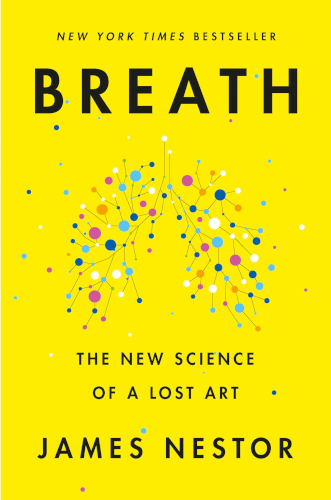

# Breath

By James Nestor

Breathing is an automatic process, but it's not a simple one, and if you haven't carefully thought about and practiced *how* you breathe, you're probably doing it wrong.

Said another way, there is likely a large space for improvement in your overall health and wellbeing that can be accessed by just learning a few things about how to breathe better. That's what this book will teach you.

*Breath*'s primary guidelines are:
1. *Breathe through your nose.* Your sinuses are adaptable. Mouth breathing begets more mouth breathing. Nose breathing begets more nose breathing.
2. *Breathe slowly*. Inhale for 5.5 seconds, exhale for 5.5 seconds, equalling 5.5 breaths per minute.
3. *Exhale fully*. Exhale *all* the air out of your lungs to make space to inhale new air.
4. *Breathe less* (volume per breath). Most of us are breathing much more air per unit time than we need to. This just means we breathe out a bunch of oxygen. Additionally, it lowers our carbon dioxide levels below healthy levels, which makes us feel more anxious and more likely to want to breathe faster (a counterintuitive vicious cycle).
5. *Chew.* A diet of soft, highly processed foods has stopped the modern human from regularly engaging in the important activity of chewing. Real, effortful chewing stimulates a healthy bone structure in the face, which allows you to breathe better.

### Sparks

> Many modern maladies — asthma, anxiety, attention deficit hyperactivity disorder, psoriasis, and more — could either be reduced or reversed simply by changing the way we inhale and exhale.
>
> The missing pillar in health is breath. It all starts there.
>
> [xix]

 

> Every one of the ancient skulls was identical to the *Parsee* sample. They all had enormous forward-facing jaws. They had expansive sinus cavities and broad mouths. And, bizarrely, even though none of the ancient people ever flossed, or brushed, or saw a dentist, they all had straight teeth.
>
> Of the 5,400 different special of mammals on the planet, humans are now the only ones to routinely have misaligned jaws, overbites, underbites, and snaggled teeth.
>
> [12]

 

> Simple training yourself to breathe through your nose, Douillard reported, could cut total exertion in half and offer huge gains in endurance. The athletes felt invigorated while nasal breathing rather than exhausted. They all swore off breathing through their mouths ever again.
>
> [24]

 

> Mouthbreathing, it turns out, changes the physical body and transforms airways, all for the worse. Inhaling air through the mouth decreases pressure, which causes the soft tissues in the back of the mouth to become loose and flex inward, creating less space and making breathing more difficult. Mouthbreathing begets more mouthbreathing.
>
> Inhaling from the nose has the opposite effect. It forces air against all those flabby tissues at the back of the throat, making the airways wider and breathing easier. And after a while, these tissues and muscles get "toned" to stay in this opened and wide position. Nasal breathing begets more nasal breathing.
>
> [27]

 

> Mouthbreathing was also making me dumber. A recent Japanese study showed that rats who had their nostrils obstructed and were forced to breathe through their mouths developed fewer brain cells and took twice as long to make their way through a maze than nasal-breathing controls.
>
> [30]

 

> The right nostril is a gas pedal. Breathing through the right side of the nose activates the sympathetic nervous system, the "fight or flight" mechanism that puts the body in a more elevated state of alertness and readiness.
>
> Inhaling through the left nostril has the opposite effect: it works as a kind of brake system to the right nostril's accelerator. The left nostril is more deeply connected to the parasympathetic nervous system, the rest-and-relax side that lowers blood pressure, cools the body, and reduces anxiety.
>
> [41]

 

> Working together, the different areas of the turbinates will heat, clean, slow, and pressurize air so that the lungs can extract more oxygen with each breath. That is why nasal breathing is far more healthy and efficient than breathing through the mouth.
>
> [45]

 

> [On George Catlin's research documenting the lives of 50 Native American tribes...]
>
> Having never seen a dentist or doctor, the tribal people had teeth that were perfectly straight — "as regular as the keys of a piano."
>
> The secret was breathing.
>
> The Native Americans explained to Catlin that breath inhaled through the mouth sapped the body of strength, deformed the face, and caused stress and disease. On the other hand, breath inhaled through the nose kept the body strong, made the face beautiful, and prevented disease.
>
> [47]

 

> Schroth had been diagnosed with scoliosis, a sideways curvature of the spine. The condition had no cure, and most children who suffered from extreme cases like Schroth's could expect to spend a life in bed or rolling around in a wheelchair.
>
> At age 16, Schroth began training herself in something called "orthopedic breathing." She would stand in front of a mirror, twist her body, and inhale into one lung while limiting air intake to the other. Then she'd hobble over to a table, sling her body on its side, and arch her chest back and forth to loosen her rib cage while breathing into the empty space.
>
> Schroth spent five years doing this. At the end, she'd effectively cured herself of "incurable" scoliosis; she'd breathed her spine straight again.
>
> [57]

 

> He'd have [the patients] hold their breath and count from one to five as many times in a row as they could. [..discussion of some other exercises...] Each of these exercises allowed the patients to let out a little more air so that a little more air could get in.
>
> After several sessions, some patients learned to speak a full sentence in a single breath for the first time in years. Others began walking.
>
> [62]

 

> After several rounds of deep breaths to open my rib cage, Martin asked me to start counting from one to ten over and over with every exhale.
>
> "Keep moving your lips! Get out the last little molecule of air!"
>
> [65]

 

> The best way to prevent many chronic health problems, improve athletic performance, and extend longevity was to focus on how we breathed, specifically to balance oxygen and carbon dioxide levels in the body. To do this, we'd need to learn how to inhale and exhale slowly.
>
> [72]

 

> For a healthy body, overbreathing or inhaling pure oxygen would have no benefit, no effect on oxygen delivery to our tissues and organs, and could actually create a state of oxygen deficiency.
>
> Inhaling [pure oxygen] might increase blood oxygen levels one or two percent, but that oxygen will never make it into our hungry cells. We'll simply breathe it back out.
>
> [77]

 

> While breathing at a normal rate, our lungs will absorb only about a quarter of the available oxygen in the air. The majority of that oxygen is exhaled back out. By taking longer breaths, we allow our lungs to soak up more in fewer breaths.
>
> [81]

(Note: "normal rate" here is not specified, but I assume he means something much faster than the ideal *5.5 - 5.5 - 5.5* breathing pattern, which is described below.)

 

> It turned out that the most efficient breathing rhythm occurred when both the length of respirations and total breaths per minute were locked in to a spooky symmetry: 5.5-second inhales followed by 5.5-second exhales, which works out almost exactly to 5.5 breaths a minute.
>
> [83]

 

> Just as we've become a culture of overeaters, we've also become a culture of overbreathers.
>
> The fix is easy: breathe less. With some effort and training, breathing less can become an unconscious habit.
>
> To be clear, breathing less is not the same as breathing slowly.
>
> The key to optimum breathing, and all the health, endurance, and longevity benefits that come with it, is to practice fewer inhale and exhales in a smaller volume.
>
> [86]

 

> *What if overbreathing wasn't the result of hypertension and headaches but the cause?* Buteyko wondered.
>
> Buteyko took a walk. In the asthma ward, he found a man stopped over, fighting suffocation, gasping for air. Buteyko approached and showed him the technique he'd been using on himself [breathing less, relaxing his chest and stomach and sipping air through his nose]. After a few moments, the patient calmed down. He inhaled a careful and clear breath through his nose and then calmly exhaled. Suddenly, his face flushed with color. The asthma attack was over.
>
> [90]

 

> [Discussing asthma attacks...]
>
> "When people hyperventilate, there is something very strange happening. In essence they are taking in too much air. But the sensation that they get is shortness of breath, choking, air hunger, as if they're not getting enough air. It's almost like a biological system error."
>
> Willing the body to breathe less air appeared to correct that system error.
>
> [101]

 

> Hypoventilation training [breathing less than normal, in particular holding the breath with lungs half-empty] provided a boost in red blood cells, allowing athletes to carry more oxygen and produce more energy with each breath. Breathing *way less* delivered the benefits of high-altitude training at 6,500 feet, but it could be used at sea level, or anywhere.
>
> [95]

 

> "The yogi's life is not measured by the number of his days, but the number of his breaths."
>
> [104]

 

> The same story played out no matter where he went. Societies that replaced their traditional diet with modern, processed foods suffered up to ten times more cavities, severely crooked teeth, obstructed airways, and overall poorer health.
>
> [114]

 

> The problem had less to do with what we were eating than how we ate it.
>
> *Chewing*.
>
> It was the constant stress of chewing that was lacking from our diets.
>
> Our ancient ancestors chewed for hours a day, every day, And because they chewed so much, their mouths, teeth, throats, and faces grew to be wide and strong and pronounced. Food in industrialized societies was so processed that it hardly required any chewing at all.
>
> [116]

 

> The more we gnaw, the more stem cells release, the more bone density and growth we'll trigger, the younger we'll look and the better we'll breathe.
>
> [132]

 

> It's much more common, especially in the modern world, to never experience full-blown, life-threatening stress, but to never fully relax either. We'll spend our days half-asleep and our nights half-awake, lolling in a gray zone of half-anxiety.
>
> [149]

 

> [On Holotropic Breathwork, which uses intentional powerful heavy breathing to induce alternate states of consciousness...]
>
> Consciously sustaining these stress signals long enough may trick the more primitive limbic system into thinking the body is dying. This could explain why so many people experience sensations of death and rebirth during Holotropic Breathwork.
>
> [163]

 

> Blends of 30 percent carbon dioxide and 70 percent oxygen became a go-to treatment for anxiety, epilepsy, and even schizophrenia. With a few huffs of the stuff, patients who'd spent months or years in a catatonic state would suddenly come to. They'd open their eyes, look around, and begin calmly talking with doctors and other patients.
>
> "It was a wonderful feeling. It was marvelous. I felt very light and didn't know where I was," one patient reported.
>
> [175]

The point: it's not the case that oxygen is good and carbon dioxide is bad. Optimal health is found in a specific balance of the two.

 

> People with anorexia or panic or obsessive-compulsive disorders consistently have low carbon-dioxide levels and a much greater fear of holding their breath. To avoid another attack, they breathe far too much and eventually become hypersensitized to carbon dioxide and panic if they sense a rise in this gas.
>
> They are anxious because they're overbreathing, overbreathing because they're anxious.
>
> [177]

 

> What distinguishes inanimate objects like rocks from birds and bees and leaves is the level of energy, or the "excitability" of electrons within those atoms that make up the molecules in matter. The more easily and often electrons can be transferred between molecules, the more "desaturated" matter becomes, the more *alive* it is.
>
> [192]

I'm not sure how accurate this is to the biological definition of *life*, but I find this characterization quite interesting regardless.

 

> "More than sixty years of research on living systems has convinced me than our body is much more nearly perfect that the endless list of ailments suggests," wrote Nobel laureate Albert Szent-Gyorgyi. "Its shortcomings are due less to its inborn imperfections than to our abusing it."
>
> [205]

 

> In a nutshell, this is what we've learned.
>
> * Shut your mouth.
> * Breathe through your nose.
> * Exhale [fully].
> * Chew.
> * Breathe more, on occasion.
>   * Willing yourself to breathe heavily for a short, intense time can be profoundly therapeutic.
> * Hold your breath.
> * How we breathe matters.
>   * The perfect breath is this: Breathe in for about 5.5 seconds, then exhale for 5.5 seconds. That's 5.5 breaths per minute for a total of about 5.5 liters of air.
>
> [206]

 

---

 

Return to the [Book List](Readme.md#book-list).
