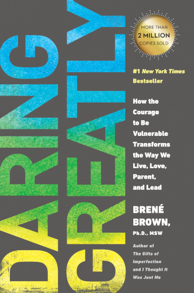

# Daring Greatly

By Brene Brown

Vulnerability is not weakness, it's strength. And it may be one of the most inspiring and connecting aspects of our humanity.

But how do we cultivate the courage to be vulnerable? How do we avoid the fear, anxiety, and shame that we worry must accompany it? Brene Brown gives a passionate and practical set of answers to this question in *Daring Greatly*.

If you're a parent, or soon-to-be, you'll also find some unexpectly sharp insights on parenting along the way.

### Sparks

> When we spend our lives waiting until we're perfect or bulletproof before we walk into the arena, we ultimately sacrifice relationships and opportuniities that may not be recoverable, we squander our precious time, and we turn out backs on our gifts, those unique contributions that only we can make.
>
> [2]

 

> [After listing a bunch of completions to the sentence: "Vulnerability is ______"...]
>
> Do these sound like weaknesses?
>
> NO. *Vulnerability sounds like truth and feels like courage.*
>
> [37]

 

> The researchers found that the participants who thought they were not susceptible or vulnerable to deceptive advertising were, in fact, the most vulnerable.
>
> "Far from being an effective shield, the illusion of invulnerability undermines the very response that would have supplied genuine protection."
>
> [40]

 

> When our self-worth isn't on the line, we are far more willing to be courageous and risk sharing our raw talkents and gifts. Shame-resilient cultures nurture folks who are much more open to soliciting, accepting, and incorporating feedback.
>
> [64]

 

> "Shame becomes fear. Fear leads to risk aversion. Risk aversion kills innovation."
>
> [66]

 

> But success and recognition and approval are not the values that drive me. My value is courage and I was just courageous. You can move on, shame.
>
> [67]

 

> There are no data to support that shame is a helpful compass for good behavior.
>
> [73]

 

> If we can share our story with someone who responds with empathy and understanding, shame can't survive.
>
> [75]

 

> We judge people in areas where we're vulnerable to shame, especially picking folks who are doing worse than we're doing. If I feel good about my parenting, I have no interest in judging other people's choices. If I feel good about my body, I don't go around making fun of other people's weight or appearance.
>
> [99]

 

> Joy comes to us in moments — ordinary moments. We risk missing out on joy when we get too busy chasing down the extraordinary.
>
> [125]

 

> As I conducted my interviews, I realized that only one thing separated the men and women who felt a deep sense of love and belonging from the people who seemed to be struggling for it. That one thing was the belief in their worthiness. It's as simple and complicated as this: If we want to fully experience love and belonging, we must believe that we are worthy of love and belonging.
>
> [145]

 

> Are my choices leading to my Wholeheartedness, or do they leave me feeling empty and searching?
>
>  [147]

 

> A leader is anyone who holds her- or himself accountable for finding potential in people and processes.
>
> [185]

 

> Christine Day explained that she was once a very bright, smart executive who "majored in being right." Her transformation came when she realized that getting people to engage and take ownership wasn't about "the telling" but about letting them come into the idea in a purpose-led way, and that her job was creating the space for others to perform.
>
> The shift she described is the shift from controlling to engaging with vulnerability — taking risks and cultivating trust.
>
> [209]

 

> The question isn't so much "Are you parenting the right way?" as it is: "Are you the adult that you want your child to grow up to be?"
>
> As Joseph Chilton Pearce writes, "What we *are* teaches the child more than what we say, so we must *be* what we want our children to become."
>
> [217]

> [As parents...]
>
> Are we sending them overt or covert messages about what makes them more and less lovable? Or are we focusing on behaviors that need to change and making it clear that their essential worthiness is not on the table?
>
> [221]

 

> *Belonging* is being somehwere you want to be, and they want you. *Fitting in* is being somehwer you really want to be, but they don't care one way or the other.
>
> *Belonging* is being accepted for you. *Fitting in* is being accepted for being like everyone else.
>
> I get to be me if I belong. I have to be like you to fit in.
>
> [232]

 

> "Compassion is not a relationship between the healer and the wounded. It's a relationship between equals. Only when we know our own darkness well can we be present with the darkness of others. Compassion becomes real when we recognize our shared humanity."
>
> [234]

 

---

 

Return to the [Book List](Readme.md#book-list).
