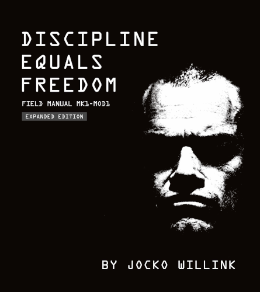

# Discipline Equals Freedom

By Jocko Willink

Never have I read a book with so much **Get Up And GO** power as this. This is a book that, while reading it in the middle of the night about to go to sleep, makes you want to jump up out of bed and go run in the cold dark night outside. I actually did that once.

This book has an unparalleled and infectious energy of drive and action that can't *not* fill you and motivate you when you read it.

It also has a very unique format and writing style. I wouldn't even call it a *book* in the standard sense; it describes itself as a *Field Manual*. Each page is headlined with a particular topic, and contains a very powerful and concise message about that topic. There aren't a lot of words on each page, and for that the messages are even more striking and resonant.

### Sparks

> **The Way of Discipline**
>
> People look for the shortcut. The hack.
>
> And if you came here looking for that: You won't find it.
>
> The shortcut is a lie. The hack doesn't get you there.
>
> To reach goals and overcome obstacles and become the best version of you possible will not happen by itself. It will not happen cutting corners, taking shortcuts, or looking for the easy way.
>
> **There is no easy way.**
>
> How do you become stronger, smarter, faster, healthier? How do you become better? How do you achieve true freedom?
>
> There is only one way.
>
> **The way of discipline.**
>
> [2]

 

> If you don't think you are disciplined:
>
> It is because you haven't decided to be disciplined. **YET**.
>
> It is because you haven't created it. **YET**.
>
> So where does it come from?
>
> It comes from *you*.
>
> [7]

 

> They have an idea in their head... Maybe even a *vision*.
>
> But they don't know where to start – so they ask: "Where do I start?" "When is the best time to start?"
>
> And I have a simple answer:
>
> **HERE** and **NOW**.
>
> Take that first step and Make It Happen.
>
> [8]

 

> Don't fight stress. Embrace it. Use it to make yourself sharper and more alert. Use it to make you think and learn and get better and smarter and more effective.
>
> Use the stress to make you a better you.
>
> [20]

 

> **Destroyer Mode**
>
> It takes both *emotion* and *logic* to reach your maximum potential, to really give everything you have, to go beyond your limits.
>
> Because emotion and logic will both reach their limitations. And when one fails, you need to rely on the other.
>
> When it just doesn't make any logical sense to go on, that's when you use your emotion to push further, to push you to say one thing: I don't stop.
>
> When your feelings are screaming that you have had enough, override that emotion with concrete logic and willpower that says one thing: I don't stop.
>
> Fight weak emotions with the power of logic; fight the weakness of logic with the power of emotion.
>
> And in the balance of those two, you will find the strength and the tenacity and the guts to say to yourself:
>
> **I. DON'T. STOP.**
>
> [23]

 

> Don't let nature or nurture make you.
>
> Choose to **MAKE. YOUR. SELF.**
>
> [39]

 

> Those donuts aren't food.
>
> **THEY ARE POISON.**
>
> It doesn't fuel you. It kills you.
>
> It isn't going to make you stronger, faster, healthier, smarter, or better. It's going to do the opposite. And you know this.
>
> "But it's the only choice."
>
> **WRONG.**
>
> Unless you have gone an extended period of time [measured in days, not hours] without food, you don't need to eat.
>
> **YOU DON'T NEED TO EAT.**
>
> You don't even know what hungry is. Humans can go thirty days without food. You can make it.
>
> So. When those foods are tempting you, enticing you with their **SUGARCOATED LIES** –
>
> Stand your ground in the battle and fight by saying NO.
>
> **HOLD THE LINE.**
>
> [45]

 

> How do I handle those days when I'm just not "feeling it"?
>
> I GO ANYWAY. I GET IT DONE.
>
> Even if I am just going through the motions – I GO THROUGH THE MOTIONS.
>
> Chances are you will realize that the desire to rest was just weakness – it was the desire to take the path of least resistance  –  the downhill path  –  the downward path.
>
> And by going through the motions, you overcame that weakness.
>
> And you stayed on the righteous path – the disciplined path – You stayed on The Warpath.
>
> Right where you know you belong.
>
> [49]

 

> The battle, the struggle – the hesitation – takes place in that moment.
>
> **HESITATION IS THE ENEMY.**
>
> Hesitation allows the moment to pass, the opportunity to be lost, the enemy to get the upper hand. Hesitation turns into cowardice. It stops us from moving forward, from taking initiative, from executing what we know we must.
>
> Hesitation defeats us. So we must defeat it.
>
> Step forward. Do not hesitate. Do not wait.
>
> Go forward: and win.
>
> [55]

 

> How do I deal with setbacks, failures, delays, defeats, or other disasters? I actually have a fairly simple way of dealing with the situations, summed up in one word: "Good."
>
> Oh, mission got canceled? Good. We can focus on another one.
>
> Didn't get promoted? Good. More time to get better.
>
> Didn't get funded? Good. We own more of the company.
>
> Didn't get the job you wanted? Good. Go out, gain more experience, and build a better resume.
>
> Got beat? Good. We learned.
>
> Unexpected problems? Good. We have the opportunity to figure out a solution.
>
> [59]

 

> Don't worry about motivation. Motivation is fickle. It comes and goes.
>
> Don't expect to be motivated every day to get out there and make things happen. You won't be.
>
> Don't count on motivation. Count on Discipline.
>
> [68]

 

> My glory, it doesn't happen in front of a crowd. It doesn't happen in a stadium or on a stage. There are no medals handed out.
>
> It happens in the darkness of the early morning.
>
> **In solitude.**
>
> Where I try. And I try. And I try again.
>
> With everything I have, to be the best that I can possibly be.
>
> [71]

As I learned from David Goggins, forever imprinted on my mind: It's all about the *unseen work*. The workouts and study sessions and struggles when other people are eating or partying or watching TV shows or lounging around and you're there, by yourself, where no one will ever see it... working hard. That's where greatness is forged.

Olympic medalists earn their gold medal not in the dazzling lights of the arena, but in the thousands of hours spent working hard in darkness and solitude long before this moment — when no one was watching, when they could have just as easily been doing something else, something easy. But they chose to be there and work for it. That's where outrageous goals become reality.

 

> It isn't in a melee of fire and destruction that most of us succumb to weakness. We are taken apart, slowly. Convinced of an easier path.
>
> Most of us aren't defeated in one decisive battle. We are defeated one tiny, seemingly insignificant surrender at a time that chips away at who we should really be.
>
> We sleep in a little later. We miss a workout, then another. We start to eat what we shouldn't eat and drink what we shouldn't drink.
>
> And, without realizing it – one day, you wake up and you have become something that you never would have allowed.
>
> So.
>
> You have **BE VIGILANT**. You have to **HOLD THE LINE** on the seemingly insignificant little things – things that shouldn't matter – but that **do**.
>
> [74]

What are you doing now, that if the you of a few years ago saw, you never would have willingly allowed?

 

> If you are going to speak but you want to remain detached, instead of making a statement try asking a question. A statement plants you into the ground and removes your maneuverability; you become attached. A question keeps your mind open and allows you to remain detached.
>
> **To be better and do better: Detach.**
>
> [95]

 

> **Menial Tasks**
>
> Because they are wearisome, we don't want to carry out these burdens.
>
> WRONG ANSWER.
>
> If you have things to do, **DO THEM.**
>
> **DO THEM HARD.**
>
> Don't let them hang over your head. Get them done. Line them up and **KNOCK THEM OUT**.
>
> Get those tasks off your plate so you can move on to bigger and better things.
>
> [127]

 

> These challenges you face, they are going to do their best to *Take You Down*.
>
> **DO NOT LET THEM.**
>
> Instead, let these challenges raise you up – let them elevate you.
>
> Let their demands and their trials make you stronger – let the adversity you face today turn you into a better person tomorrow.
>
> So, in the future, you look back at these struggles and you say to them: Thank you – you made me better.
>
> [79]

 

---

 

Return to the [Book List](Readme.md#book-list).
