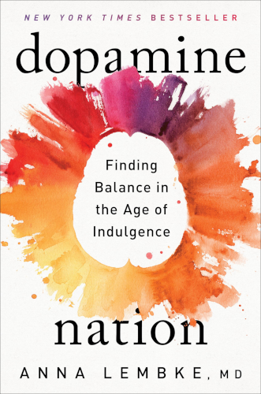

# Dopamine Nation

By Anna Lembke

 

> This book is about pleasure. It's also about pain. Most important, it's about the relationship between pleasure and pain, and how understanding that relationship has become essential for a life well lived.
>
> Why?
>
> Because we've transformed the world from a place of scarcity to a place of overwhelming abundance. The smartphone is the modern-day hypodermic needle, delivering digital dopamine 24/7 for a wired generation.
>
> [1]

> This book aims to unpack the neuroscience of reward and, in doing so, enable us to find a better, healthier balance between pleasure and pain.
>
> [2]

### Sparks

> Boredom is not just boring. It can also be terrifying. It forces us to come face-to-face with bigger questions of meaning and purpose. But boredom is also an opportunity for discovery and invention. It creates the space necessary for a new thought to form, without which we're endlessly reacting to stimuli around us, rather than allowing ourselves to be within our lived experience.
>
> [41]

 

> The reason we're all so miserable may be because we're working so hard to avoid being miserable.
>
> [46]

 

> In the approximately two years in which I compulsively consumed romance novels, I eventually reached a place where I could not find a book I enjoyed.
>
> The paradox is that hedonism, the pursuit of pleasure for its own sake, leads to *anhedonia*, which is the inability to enjoy pleasure of any kind.
>
> [57]

 

> Our brains are not evolved for this world of plenty.
>
> "We are cacti in the rain forest." And like cacti adapted to an arid climate, we are drowning in dopamine.
>
> [67]

 

> Rats given unlimited access to cocaine for six hours per day gradually increase their lever-pressing [which gives them cocaine] over time to the point of physical exhaustion and even death.
>
> However, rats who have access to cocaine for only one hour per day use steady amounts of cocaine over many consecutive days.
>
> This study suggests that by restricting drug consumption to a narrow window of time, we may be able to moderate our use and avoid the compulsive and escalating consumption that comes with unlimited access.
>
> [101]

You don't have to be addicted to cocaine to find benefit from this phenomenon. I'd suggest applying this idea to food, social media, gaming, or any other high-dopamine activity.

 

> A gluten-free diet, which previously had effectively limited consumption of high-calorie processed foods such as cakes, cookies, crackers, cereal, pastas, and pizzas, now no longer does. For those who were benefiting from gluten-free as a category to limit consumption of bread, cakes, and cookies, the category no longer serves.
>
> The evolution of the gluten-free diet illustrates how attempts to control our consumption are swiftly countered by modern marked forces, just one more example of the challenges inherent in our dopamine economy.
>
> [113]

**Dopamine economy** strikes me as a potent, prescient, and frighteningly accurate term. We might want to think about how we can move away from such an economy in the future.

 

> She removed all alcohol save one beer, which she left in her refrigerator. She called it her "totemic beer," which she regarded as the symbol of her choice not to drink, a representation of her will and autonomy. She told herself that she only needed to focus on not drinking that one beer rather than the more daunting task of not drinking any beer from the vast quantity available in the world.
>
> [117]

 

> [Socrates:]
>
> "How strange would appear to be this thing that men call pleasure! And how curiously it is related to what is thought to be its opposite, pain! If you seek the one and obtain it, you are almost bound always to get the other as well, just as though they had both been attached to the same head."
>
> By pressing on the pain side of the balance, might we achieve a more enduring source of pleasure?
>
> [147]

 

> **Pain to Treat Pain**
>
> [Researchers] found that the subjective experience of pain caused by an initial painful stimulus was lessened with the application of a second painful stimulus. Further, nalaxone, an opioid receptor blocker, prevented this phenomenon, suggesting that the application of pain triggers the body's own endogenous (self-made) opioids.
>
> [153]

 

> The top-paid 20 percent were twice as likely to work long hours as the lowest-paid 20 percent. Economists speculate that this change is due to higher rewards for those at the top of the economic food chain.
>
> [169]

I have definitely felt the inverse of this effect while being at the bottom of a company employee hierarchy. I wonder: What can we do to increase the rewards for those lower down?

I think it comes down to giving them more trust, ownership over their work, and freedom to bring out their own unique talents.

 

> Telling the truth draws people in, especially when we're willing to expose our own vulnerabilities. This is counterintuitive because we assume that unmasking the less desirable aspects of ourselves will drive people away.
>
> In fact, the opposite happens. People come closer. They see in our brokenness their own vulnerability and humanity. They are reassured that they are not alone in their doubts, fears, and weaknesses.
>
> [182]

 

> If the therapist can help the patient take responsibility if not for the event itself, then for how they react to it in the here and now, that patient is empowered to move forward with their life.
>
> [187]

 

> [On measuring adherence to group principles...]
>
> One way to "measure" group participation is indirectly, by mandating stigmatizing behaviors that reduce participation in other contexts, and by demanding the sacrifice of the individual's resources to the exclusion of other activities.
>
> You might think that religion organizations and other social groups that are more relaxed, with fewer rules and strictures, would attract a larger group of followers. Not so. "Stricter churches" achieve a larger following and are generally more successful because they ferret out free riders and offer more robust club goods.
>
> [221]

"Brick walls aren't there to keep us out, they're there to gives a chance to show how badly we want something." — Randy Pausch, [The Last Lecture](the_last_lecture.md)

 

> My success was an unexpected byproduct, not the thing I was seeking.
>
> [233]

 

---

 

Return to the [Book List](Readme.md#book-list).
