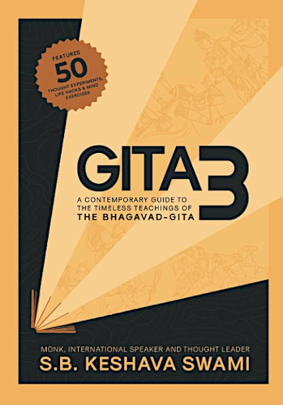

# Gita 3

By S.B. Keshava Swami

This book offers simple, elegant explanations of ideas from each chapter of the Bhagavad Gita's, along with exercises that force the reader to critique these ideas and question if and how they apply to one's own life.

I found the exercises particularly helpful — it's all too easy to passively read a book, absorb very little from it, and move on to the next thing. The exercises in this book are short and easy enough that it doesn't feel like "extra work" to do them, but powerful enough that they really help internalize and solidify the ideas in your mind.

The book goes through the Bhagavad Gita three times, offering a different perspective on each chapter every time; hence the title *Gita 3*.

### Sparks

> Krishna invites us to think differently. We must resist the temptation to be 'normal', because those who are now considered 'normal' accept the principles and practices of an insane world. *Are you ready to be different?*
>
> [15]

 

> In troublesome times, we shouldn't impulsively clutch for an external fix, but rather focus on nurturing internal growth. In difficulty, we often look up at God as victims and ask, "*Why is this happening to me?*" Instead, we could look up as seekers and ask, "*How can I learn and grow from this?*"
>
> [16]

 

> Though this may sound deflating, it's actually extremely liberating. We can only control our effort and endeavour — the rest is in the hands of providence. Knowing this, in times of achievement we feel immense gratitude, and in times of adversity we remain determined and hopeful.
>
> [31]

 

> We shouldn't fall into the trap of identifying with every message that goes through our head. Through detachment, we learn to ignore many of the mind's unwarranted demands.
>
> [36]

 

> People may acknowledge us for *what we do*, but they invariably remember us for *who we are*.
>
> [56]

 

> **The Blessings of Unanswered Prayers**
>
> *I asked God for strength, that I might achieve. \
> I was made weak, that I might learn humbly to obey.*
>
> *I asked for health, that I might do greater things. \
> I was given infirmity, that I might do better things.*
>
> *I asked for riches that I might be happy; \
> I was given poverty that I might be wise.*
>
> *I asked for power that I might have the praise of men; \
> I was given weakness that I might feel the need of God.*
>
> *I asked for all things that I might enjoy life; \
> I was given life that I might enjoy all things.*
>
> *I got nothing that I had asked for, \
> but everything that I had hoped for.*
>
> *Almost despite myself my unspoken prayers were answered; \
> I am, among all men, most richly blessed.*
>
> — Unknown Confederate soldier
>
> [62]

 

> It's difficult to *find* your *dharma*, but just as challenging to wholeheartedly *live* your *dharma*. Even when we know [our *dharma*], various factors deviate us from the path we should be treading. The expectations of others, the desire for appreciation and accolade, the restlessness and intrigue of trying new things, and the common delusion that the grass is greener on the other side.
>
> [100]

 

> [The mind] often sees the problems in every opportunity, instead of seeing the opportunities in every problem. The mind, it seems, is on a relentless mission to distract us from finding perfection in the present.
>
> [105]

 

> The thought of death need not be seen as an inconvenient truth, but rather the ultimate meditation to reinstate clarity and perspective into [our life]. Consider the following:
>
> *Priority* — Death reminds us of our priorities; those critical things we have to pursue before time runs out.
>
> *Urgency* — Death not only reminds us of what is important, but urges us to pursue it now.
>
> *Humility* — Our utter powerlessness in counteracting death helps us realize we're not in control.
>
> *Immunity* — In the face of permanent expiry, all of our worries and anxieties pale into insignificance.
>
> [113]

 

> Krishna offers an overarching model to guide our discourse. Words, He recommends, should be truthful, pleasing, and beneficial.
>
> [144]

 

> *"If all the words you said today were written over your body, would you still look like a saintly person?"*
>
> [145]

 

> *Can you think of a fear you have now that you didn't have twenty years ago? Can you think of a fear from your youth that you've managed to overcome?*
>
> Fear is something which is learned, and that means it can also be unlearned.
>
> [148]

 

> During the British rule of India, the government was concerned about the number of venomous cobra snakes in Delhi. To mitigate the issue, the Government advertised a generous bounty for every dead cobra. Enterprising people began to breed cobras and then turn them over for the extra income. When the Government realized what had happened, they scrapped the scheme. The cobra-breeders then set all the 'worthless' snakes free, and the number of cobras increased exponentially!
>
> Not only do artificial solutions fail to address the root cause, but they often aggravate the problem due to ignorance of the unintended consequences of the so-called solution.

 

> The problem is our reaction to the problem. Instead of waiting for a peaceful situation around us, the greatest need of the day is to create a peaceful situation within us.
>
> [195]

 

---

 

Return to the [Book List](Readme.md#book-list).
