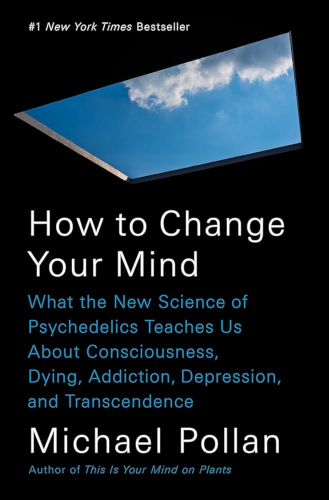
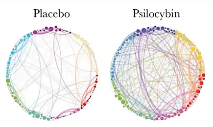

# How to Change Your Mind

By Michael Pollan

Psychedelics aren't just for people who want to transform the world into a kaleidoscopic panorama — they can actually teach us a lot about how our minds work, and can give us experiences that have a lasting impact on the way we view life and the universe.

Of particular interest are two phenomena. First, psychedelic experiences can be used with great therapeutic benefit to help those with psychological trauma, addiction, or depression. Secondly, psychedelic experiences seem to be an intriguing portal to states of ego death and unified consciousness — the feeling of being one with everything — very similar to those that meditation also aims to cultivate.

For me, this book strongly convinced me that if it were normal for the average person to have one or two psychedelic experiences in their life, the world would be a much more compassionate, loving, and peaceful place. Our societies would be filled with more open-mindedness, collaboration, and empathy, rather than ego-centric competition and "me versus other" mindsets.

I also think that simply by reading this book, which exposes one to the ways in which these experiences transform people's patterns of thinking, one can then start to cultivate these changes actively — without the need to take a psychedelic substance oneself. Certainly the magnitude will be lesser this way, but I have personally felt substantial change in my mindset since reading this book. This came simply from reading the book and attempting to consciously reproduce the states of mind described therein.

### Sparks

> One good way to understand a complex system is to disturb it and see what happens.
>
> [4]

 

> Psychedelics seldom affect people the same way twice, because they tend to magnify whatever's already going on both inside and outside one's head.
>
> [6]

 

> LSD appears to disable such conventionalized, shorthand modes of perception and, by doing so, restores childlike immediacy, and sense of wonder, to our experience of reality, as if we were seeing everything for the first time.
>
> [9]

 

> The idea that brains create consciousness — an idea accepted without question by most scientists — "is a metaphysical assumption, not a scientific fact."
>
> [41]

If you find it hard to imagine what the alternative might be, consider that the brain might instead be a portal or bridge to consciousness, rather than the original source of it.

> "If you wanted to find the blonde who delivered the news last night, you wouldn't look for her in the TV set."
>
> [56]

In this analogy, although "the blonde who delivered the news" appears to be "in the TV" in some sense, the TV is really just a receiver. The underlying original source of this information — the living human being — exists in an entirely different time, place, and form.

 

> Then I remembered what they told me, that whenever you encounter anything scary, go toward it. So instead of being afraid of dying, I got curious about what was going on. I was no longer trying to avoid dying. Instead of recoiling from the experience, I began to interrogate it. And with that, the whole situation dissolved into this pleasant floaty feeling, and I became the music for a while.
>
> [65]

 

> Early on I began to perceive that the effects of the drug respond strikingly to my own subjective determination. If I begin to tense up with anxiety, the whole scene appears to tighten in some way. But if I then consciously remind myself to relax, to let myself go into the experience, the effect is dramatic. The space in which I seem to find myself, already enormous, suddenly yawns open even further.
>
> [67]

In a sense, these experiences seem very much like a dream, but with the intensity and vividness massively amplified. Or like Neo in the Matrix (which was almost certainly inspired by the experience of dreaming).

If you believe it to be so, thus, it is so.

 

> People come out of these experiences understanding these platitudes in a new way; what was merely known is now felt, takes on a deeply rooted conviction. And, more often than not, the conviction concerns the supreme importance of love.
>
> [71]

 

> Samorini calls this a "depatterning factor". There are times in the evolution of a species when the old patterns no longer avail, and the radical, potentially innovative perceptions and behaviors that psychedelics sometimes inspire may offer the best chance for adaption. Think of it as a neurochemically induced source of variation in a population.
>
> [124]

 

> "I am part of this stream of molecules that are flowing through nature. I am given a voice, given consciousness for a time, but I feel that I am part of this continuum of stardust into which I am born and to which I will return at the end of this life."
>
> [125]

 

> It began to grate on my nerves, until I decided I would be better off regarding the sound as beautiful, and then all at once it was.
>
> [130]

I have been applying this to life in general (no psychedelics involved) and have found this strategy surprisingly effective.

 

> [Stanislav Grof] concluded that with the help of LSD many people can indeed recall the circumstances of their birth, especially when it was a difficult one.
>
> [155]

 

> Most clients [of psychedelic therapy sessions] emerged with "notable and fairly sustainable changes in beliefs, attitudes, and behavior, way above statistical probability."
>
> [178]

This was from a study in the 1960s. The science of psychedelic therapy has actually been around for a long time, but the ban on LSD combined with the negative propaganda buried the the powerful discoveries of this research.

 

> Subjects reported much greater fluidity in their thinking, as well as an enhanced ability to both visualize a problem and recontextualize it. "We were amazed, as were our participants, at how many novel and effective solutions came out of our sessions."
>
> [179]

 

> Schwartz said that several of the early computer engineers relied on LSD in designing circuit chips, especially in the years before they could be designed on computers. "You had to be able to visualize a staggering complexity in three dimensions, hold it all in your head. They found that LSD could help."
>
> [182]

 

> "The main thing is to surrender to the experience, even when it gets difficult. Surrender to your fear. The biggest fears that come up are the fear of death and the fear of madness. But the only thing to do is surrender. So surrender!"
>
> [234]

 

> I had had a psycholytic dose [a small dose] of LSD, one that allowed the patient to explore his psyche in an unconstrained but still deliberate manner while remaining sufficiently combobulated to talk about it. For me it felt less like a drug experience — than a novel mode of cognition, falling somewhere between intellection and feeling.
>
> [253]

 

> [Description of ego dissolution during a psychedelic experience...]
>
> I hesitate to use the "I" to denote the presiding awareness, it was so different from my usual first person. Where that self had always been a subject encapsulated in this body, this one seemed unbounded by *any* body, even though I now had access to its perspective. That perspective was supremely indifferent, neutral on all questions of interpretation, and unperturbed even in the face of what should by all rights have been an unmitigated personal disaster. Yet the "personal" had been obliterated.
>
> [264]

 

> Temporarily freed from the tyranny of the ego, we get to experience an extreme version of Keats's "negative capability" — the ability to exist amid doubts and mysteries without reflexively reaching for certainty.
>
> [271]

(The original use of the term *negative capability* by John Keats is given [here](https://en.wikipedia.org/wiki/Negative_capability).)

 

> "I had the feeling — no, the *knowledge* — that every single thing there is is made of love."
>
> [275]

 

> So perhaps spiritual experience is simply what happens in the space that opens up in the mind when "all mean egotism vanishes."
>
> While the ego sleeps, the mind plays, proposing unexpected patterns of thought and new rays of relation. The gulf between self and world closes down, allowing us to feel less separate and more connected, "part and particle" of some larger entity.
>
> [289]

 

> Carhart-Harris and his colleagues had discovered that psilocybin reduces brain activity, with the falloff concentrated in one particular brain network that at the time he knew little about: the default mode network.
>
> [301]

 

> The steepest drops in default mode network activity correlated with his volunteers' subjective experience of "ego dissolution".
>
> "I didn't know where I ended and my surroundings began."
>
> [304]

I think you'll find that even without psychedelic influence, the question "Where do I end and my surroundings begin?" is unanswerable if you force yourself to be absolutely precise.

 

> Normal waking consciousness feels perfectly transparent, and yet it is less a window on reality than the product of our imaginations — a kind of controlled hallucination.
>
> Unlike these other states of consciousness [dreams, psychedelic trips, psychotic delusions], ordinary waking consciousness has been optimized by natural selection to best facilitate our everyday survival.
>
> Indeed, that feeling of transparency we associate with ordinary consciousness may owe more to familiarity and habit than it does to verisimilitude.
>
> [308]

 

> He suspects that there are moments during the psychedelic experience when confidence in our usual top-down concepts of reality collapses, opening the way for more bottom-up information to get through the filter. But when all that sensory information threatens to overwhelm us, the mind furiously generates new concepts (crazy or brilliant, it hardly matters) to make sense of it all — "and so you might see faces coming out of the rain."
>
> "That's the brain doing what the brain does" — that is, working to reduce uncertainty by telling itself stories.
>
> [311]

This points to an interesting power of the brain that I've come across elsewhere as well: the tremendous ability of the brain to fill in gaps or modify "truth" to create a coherent story, all without you realizing there has been any fabrication at all.

This can show up in interesting ways in those with amnesia, where the brain automatically fills in blanks in the past with preposterously incorrect information. It also occurs in split-brain patients where one half of the brain will make up a completely false story to justify why the other half of the brain made a certain decision — and it will assert this blatantly fabricated story with absolute conviction.

 

> "Distinct networks [of the brain] became less distinct under the drug, implying that they communicate more openly. The brain operates with greater flexibility and interconnectedness under hallucinogens."
>
> [316]

The book includes the following image, which shows the activity of neural connections in the brain while subjects are under the influence of psilocybin versus a placebo:

[318]

 

> Learning entails the establishment of new neural circuits; these get stronger the more exercise they get. The long-term fate of the novel connections formed during the psychedelic experience — whether they prove durable or evanescent — might depend on whether we recall and exercise them after the experience ends.
>
> [320]

I take this to mean: If you experience some new way of thinking or perceiving during a psychedelic experience, try to repeatedly recreate that particular mental state afterwards. This will help exercise the new connections and thereby cement the changes into you brain.

 

> "I think of childhood as the R&D stage of the species. We adults are production and marketing."
>
> "Each generation of children confronts a new environment, and their brains are particularly good at learning and thriving in that environment. Think of children of immigrants, or four-year-olds confronted with an iPhone. Children don't invent these new tools, they don't create the new environment, but in every generation they build the kind of brain that can best thrive in it."
>
> [327]

 

> A recent paper in *Current Biology* described an experiment in which pieces of music that held no personal relevance for volunteers were played for them while on LSD. Under the influence of the psychedelic, however, volunteers attributed marked and lasting personal meaning to the same songs. These medicines may help us construct meaning, if not discover it.
>
> [354]

 

> Bertrand Russel wrote that the best way to overcome one's fear of death "is to make your interests gradually wider and more impersonal, until bit by bit the walls of the ego recede, and your life becomes increasingly merged in the universal life."
>
> [355]

 

> "And suddenly I realized that the molecules of my body, and the molecules of my spacecraft, the molecules in the body of my partners, were prototyped, manufactured in some ancient generation of stars. [I felt] an overwhelming sense of oneness, of connectedness... It wasn't 'Them and Us,' it was 'That's me! That's all of it, it's one thing.'"
>
> [359]

 

> "Everything in the universe is of equal importance, including yourself."
>
> [362]

 

> Matt Johnson believes that psychedelics can be used to change all sorts of behaviors, not just addiction. The key, in his view, is their power to occasion a sufficiently dramatic experience to "dope-slap people out of their story."
>
> "Psychedelics open a window of mental flexibility in which people can let go of the mental models we use to organize reality."
>
> [366]

 

> After people have had even a relatively modest experience of awe, such as looking at soaring trees, they're more likely to come to the assistance of others.
>
> [374]

 

> The default mode network appears to be the seat not only of the ego, or self, but of the mental faculty of time travel as well. The are of course closely related: without the ability to remember our past and imagine a future, the notion of a coherent self could hardly be said to exist.
>
> [387]

A story needs time, and the ego is the story the mind tells itself about who it is.

Interestingly, *the ego* and *time* are the two fundamental causes of suffering that Eckhart Tolle repeatedly returns to in his talks and books — eliminate either of these (which will cause the other to vanish as well) and suffering cannot exist.

Perhaps what this really means is that the default mode network is the source of suffering — if we can train ourselves to turn down the default mode network, suffering will dissolve.

In my experience so far at least, this has been an effective approach.

 

> "What in the world were you *thinking*?" Apparently, I'd dropped way below baseline [of neural activity in the posterior cingulate cortex, a central node in the default mode network].
>
> I told him, in general terms. He sounded excited by the idea that the mere recollection of a psychedelic experience might somehow replicate what happens in the brain during the real thing.
>
> [395]

 

---

 

Return to the [Book List](Readme.md#book-list).
