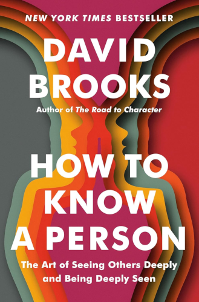

# How to Know a Person

By David Brooks

> There is one skill that lies at the heart of any healthy person, family, school, community organization, or society: the ability to see someone else deeply and make them feel seen — to accurately know another person, to let them feel valued, heard, and understood.
>
> That is at the heart of being a good person, the ultimate gift you can give to others and to yourself.
>
> [9]

This, of course, is the skill that *How to Know a Person* aims to teach.

### Sparks

> The quality of our lives and the health of our society depends, to a large degree, on how well we treat each other in the minute interactions of daily life.
>
> [9]

 

> Artificial intelligence is going to do many things for us in the decades ahead, and replace humans at many tasks, but one thing it will never be able to do is to create person-to-person connections. If you want to thrive in the age of AI, you better become exceptionally good at connecting with others.
>
> [11]

 

> "To speak to him was to be seduced by an inverse charisma, a sense of being listened to with such intensity that you had to be your most honest, sharpest, and best self."
>
> [13]

 

> This awareness of the infinite dignity of each person you meet is a precondition for seeing people well.
>
> [31]

 

> Zadie Smith once wrote that when she was a girl...
>
> "Above all, I wondered what it would be like to believe the sorts of things I didn't believe."
>
> [34]

What a truly mind-expanding idea.

Try picking something you believe fundamentally, with the core of your being, and ask yourself: What would it be like to believe the opposite?

If you feel so compelled, it might even be interesting to write a "day in the life" mini-story or an imaginary journal entry as if from the point of view of a person with this opposite belief.

 

> For Murdoch, the essential immoral act is the inability to see other people correctly.
>
> [38]

 

> She is offering the kind of attention that can change people.
>
> [41]

 

> This subjective layer is what we want to focus on in our quest to know other people. The crucial question is not "What happened to this person?" Instead, we should ask: "How does this person interpret what happened?"
>
> "How do they construct their reality?"
>
> [61]

 

> "Scientific evidence shows that what we see, hear, touch, taste, and smell are largely simulations of the world, not reactions to it."
>
> [66]

 

> A study of Japanese businesspeople found that they are typically comfortable with eight-second pauses between one comment and another.
>
> [78]

*Eight seconds*! And I thought two seconds was already a long pause...

 

> Find the disagreement under the disagreement.
>
> "Why, at heart, do we disagree? What is the values disagreement underneath our practical disagreement?"
>
> [80]

 

> If I'm going to get to know you, it's not because I have the magical ability to peer into your soul; it's because I have the skill of asking the sorts of questions that will give you a chance to tell me about who you are.
>
> [87]

 

> In his history *Moral Education in America*, B. Edward McClellan argues that most elementary schools began to abandon moral formation [moral education] in the 1940s and 1950s.
>
> "Educators who had once prided themselves on their ability to reshape character now paid more attention to the SAT scores of their students."
>
> [105]

> This is a massive civilizational failure. We need to rediscover ways to teach moral and social skills.
>
> [106]

 

> When someone is talking to you about pain in their life, it's best not to try to yank the conversations back to your frame. Your first job is to stay within the other person's standpoint to more fully understand how the world looks to them.
>
> [115]

 

> Remember that the person who is lower in any power structure than you are has a greater awareness of the situation than you do. A servant knows more about his master than the master knows about the servant.
>
> [115]

 

> Unconsciously, you and I are always asking ourselves, What do my physical, intellectual, social, and economic capacities enable me to do in this situation? If you and I are out with a group contemplating a hike up a mountain, different members of the group are literally seeing different mountains depending on how fit or unfit we are.
>
> [120]

 

> We as parents still carry, often unconsciously, the wounds and terrors of our *own* early years, which were, in turn, caused by the wounds and terrors of our parents' early years, and so on and so on. The wounds and traumas get down from generation to generation.
>
> [135]

 

> "The kind of love I grew up with was scary to need, and painful to feel. If I didn't have that uneasy ache, that prickly anxiety around someone, how would I know it was love?"
>
> [136]

 

> Introspection isn't the best way to repair your models, communication is.
>
> [143]

You need someone with an outside perspective, someone who can see what you can't.

 

> [On the purpose of emotions...]
>
> Emotions assign value to things.
>
> [145]

 

> It's hard to hate people close up.
>
> [154]

This is the core idea of [Contact Theory](https://en.wikipedia.org/wiki/Contact_hypothesis).

 

> There are certain things you simply have to live through in order to understand. And so another way we grow more empathic is simply by living and enduring the slings and arrows that life generally brings.
>
> [157]

 

> "Without a wound where would your power be? It is your very remorse that makes your low voice tremble into the hearts of men. The very angels themselves cannot persuade the wretched and blundering children on earth as can one human being broken on the wheels of living. In love's service only the wounded soldiers can serve."
>
> [159]

 

> People who are permanently damaged by trauma seek to *assimilate* what happened into their existing models. People who grow try to create *new* models.
>
> [162]

 

> You can try "This Is Your Life." This is a game some couples play at the end of each year. They write out a summary of the year from their partner's point of view. That is, they write, in the first person, about what challenges their partner faced and how he or she overcame them.
>
> [168]

I'm sure I would be utterly atrocious at this. I should certainly try one day when I get the chance.

 

> "Human beings are under a moral obligation to seek the improvement of our moral character."
>
> [170]

 

> One biographer wrote that Bush's particular genius was the ability to eliminate, in milliseconds, any distance between him and another person.
>
> [176]

 

> If you want to understand another person, you have to be able to describe the particular energy they bring into a room.
>
> [177]

 

> Myers-Briggs relies on false binaries. For example, it divides people into those who are good at thinking and those who are good at feeling. But in real life, the research shows, people who are good at thinking are also more likely to be good at feeling.
>
> [178]

 

> One study showed that having a mystical experience while consuming mushrooms led to a sharp increase in openness even a year later.
>
> [185]

 

> [Focus on the *positive opposite*.]
>
> Instead of calling attention to the behavior you want your child to stop, call attention to the behavior you want them to do.
>
> [188]

 

---

 

Personal opinion: you can safely stop reading this book after the chapter on *Life Tasks*, especially if you feel you are losing interest. I felt the remainder of the book was just "writing for the sake of writing" (a lot of miscellaneous story-telling) rather than an attempt to communicate something that will be valuable to the reader.

 

---

 

Return to the [Book List](Readme.md#book-list).
