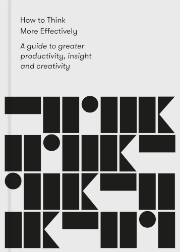
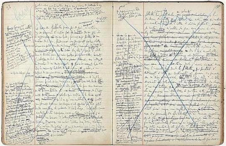

# How to Think More Effectively

By The School of Life

A short pocketbook packed with guidance about how to more effectively make our way through our lives. Though the title may suggest a primary focus on logic and rationality, this book is far more all-encompassing than that.

*How to Think More Effectively* is not about "thinking" as opposed to "feeling", it is about the optimal union of the two. It spends most of its time discussing creativity, human interactions, relationships, empathy, humor, patience, love, and other similar topics; but it approaches them from a clear-minded perspective of careful thought and reflection.

### Sparks

> We can learn to improve our chances of having good thoughts by paying closer attention to the operation of our minds and by practicing mental maneuvers designed to tease the best out of them.
>
> We should not be surprised that we are so unpracticed in this area. Our societies pay enormous attention to the results of good thinking but very little to their genesis.
>
> [2]

You might ask yourself: What was a particularly good idea you've had in the past? Perhaps think of a few.

Now, what key prior conditions or events do you think led to their genesis? Try looking backwards from each idea, then also look across your different examples for common patterns.

For me, I can universally say: All of my "good ideas" have been directly enabled by previously having spent time (which, at the time, felt like "wasting time" or "messing around" or "playing games") doing something far outside the principal domain of that idea.

The lesson I would take from this: Do something *different* from what you usually do, and do it earnestly. It will bring you unexpected benefit in the future.

 

> Our misfortune is to look always at the final results of the efforts of others, while knowing our own efforts primarily from the inside. The contrast is so great that we tend to conclude that we are incapable of anything valuable.
>
> [22]

 

> We should pay special attention not to the books but to the manuscripts of great thinkers. The French novelist Marcel Proust reads as one of the most polished and fluent writers of any age; his thoughts appear to flow ceaselessly from one point to the next.
>
> But his manuscripts suggest a different genesis. These densely packed notebooks are filled with multiple layers of changes, side notes, reminders, suggestions; sections moved about, crossed out, revised, abandoned, taken up again and ultimately rejected.
>
> [24]

 

> In every office or above every desk there should be an image from the messy early stages of a masterpiece to keep this basic, consoling, and encouraging truth where it belongs.
>
> [25]

 

> [In the shower...] We're not meant to be thinking and so — at last — we can think freely and courageously.
>
> This quality of sufficient but not overwhelming distraction might equally well be present when we're driving down the highway or walking on a beach; when there's just enough for the timid, managerial side of the mind to be doing to keep it from interfering with our authentic and bolder inner machinations.
>
> [33]

 

> From a young age, we are taught to expect that truly important ideas must lie outside of us; usually very far outside of us in time and place.
>
> We will find that the best way to convince anyone of anything we might be saying is to do our utmost to hide that we may have formulated the idea ourselves.
>
> Our heads are not understood to be where anything especially valuable might lie.
>
> [36]

Ah, yes... And that's why [Randy Pausch](the_last_lecture.md) would go around saying "My father used to say..." before any piece of wisdom he wanted to share — whether or not his father actually ever said it or not.

I hope we can learn to value individual experience (when thoughtfully considered and reflected upon) as not less, but more powerful and meaningful than citations to the sayings and references to the works of others.

 

> *In the minds of geniuses, we find — once more — our own neglected thoughts.*
>
> The genius doesn't have different kinds of thoughts from the rest of us; they simple take them more seriously.
>
> [42]

 

> [On Jules Verne's 1865 novel *From the Earth to the Moon*...]
>
> A concept could become real in part because it had first been imagined.
>
> [73]

Humans first set foot on the moon over 100 years later, in 1969.

 

> A key move of the good listener is not always to follow every byway or subplot that the speaker introduces. They are always looking to take the speaker back to their last reasonable point.
>
> The good listener (paradoxically) is a good interrupter. But they don't interrupt to intrude their own ideas; they interrupt to help the other get back to their original, more sincere, yet elusive concerns.
>
> [83]

 

> Most valuably, we are privileged to disagree with a book, and are rewarded for doing so. Nothing can quite beat the service sometimes paid to us by someone who we feel is tantalizingly off tangent; an author who starts to say something interesting, but then goes off-piste.
>
> Assisted by the author's ploughing of the intellectual landscape, our personal thoughts can germinate in authentic and vivid directions. We put down the book and find a whole portion of our own thinking revealed to us.
>
> [92]

 

> The German philosopher Immanuel Kant once credited the Scottish philosopher David Hume for teaching him how to think. Hume had done this not by lending him a set of ideas with which he could agree but by laying out with elegance and precision a whole class of philosophical positions from which he passionately dissented. [This] inspired him to arrange his objections into what would turn out to be his masterpiece, *The Critique of Pure Reason*.
>
> [92]

 

> When we are at moments of particular confusion [or "stuck"], we should try to break the stalemate in our thinking by looking out for patterns, processes, or phenomena in another subject that might bring clarity to our own.
>
> [108]

 

> Becoming more empathetic will often involve going into the less familiar and sometimes less easy to accept parts of our own minds.
>
> The unempathetic person isn't usually selfish as [much as] not fully alive to the darker, more weird recesses of themselves; the parts that are a little criminal, or wild or vulnerable or sad.
>
> The opposite of empathy isn't just thinking of yourself; it's thinking of yourself in limited ways.
>
> [114]

 

> Bad behavior is invariably the consequence of hurt: the one who shouts did not feel heard, the one who mocks was once humiliated; the constant cynic had hope snatched from them.
>
> [126]

 

> Thinking well means always trying to make a case for the opposite point of view to the one we're initially and emotionally attracted to.
>
> [133]

 

---

 

Return to the [Book List](Readme.md#book-list).
