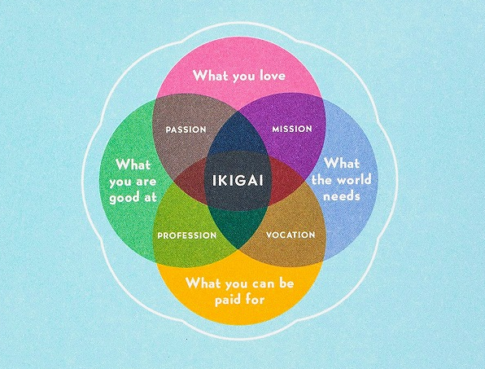

# Ikigai

By Hector Garcia and and Francesc Miralles

#### What is Ikigai?

This book carefully investigates the lives of those who live in the regions that have the most centenarians (people who live to be 100 years old) in the world. The authors share engaging interviews and stories from interacting firsthand with these people. They then look for patterns that can be transformed into guidelines for our own lives.

The questions that guide this research, and that this book aims to solve are the following:

> Is *Ikigai* the reason there are more centenarians in Okinawa than anywhere else? How does it inspire people to stay active until the very end? What is the secret to a long and happy life?
>
> [3]

> As we conducted our interviews with the eldest residents of the town, we realized that something far more powerful than just these natural resources was at work: an uncommon joy flows from its inhabitants and guides them through the long and pleasurable journey of their lives.
>
> Again, the mysterious *ikigai*.
>
> But what is it, exactly? How do you get it?
>
> [4]

### Sparks

> There is, in fact, no word in Japanese that means *retire* in the sense of "leaving the workforce for good" as in English.
>
> [10]

 

> One of the most common saying in Japan is "Hara hachi bu," which is repeated before or after eating and means something like "Fill your belly to 80 percent." Ancient wisdom advises against eating until we are full.
>
> [14]

 

> It is customary in Okinawa to form close bonds within local communities. A *moai* is an informal group of people with common interests who look out for one another. For many, serving the community becomes part of their *ikigai*.
>
> The feeling of belonging and support gives the individual a sense of security and helps increase life expectancy.
>
> [16]

 

> A little stress is good for you.
>
> While sustained, intense stress is a known enemy of longevity and both mental and physical health, low levels of stress have been shown to be beneficial.
>
> [27]

 

> Spending too much time seated at work or at home not only reduces muscular and respiratory fitness but also increases appetite and curbs the desire to participate in activities.
>
> [28]

I think this is so counterintuitive it's worth emphasizing: sitting down makes you hungrier. If you're hungry, get up and walk around, be active — your hunger will go away.

(My personal experience strongly affirms this.)

 

> One study, conducted at Yeshiva University, found that the people who live the longest have two dispositional traits in common: a *positive attitude* and a high degree of *emotional intelligence*. In other words, those who face challenges with a positive outlook and are able to manage their emotions are already well on their way toward longevity.
>
> [31]

 

> **Naikan meditation**
>
> 1. What have I received from person X?
> 2. What have I given to person X?
> 3. What problems have I caused person X?
>
> Through these reflections, we stop identifying others as the cause of our problems and deepen our own sense of responsibility.
>
> [50]

 

> The ideal is to find something aligned with our abilities but just a bit of a stretch, so we experience it as a challenge. This is what Ernest Hemingway meant when he said, "Sometimes I write better than I can."
>
> [59]

 

> | Concentrating on a Single Task | Multitasking |
> | ------------------------------ | ------------ |
> | Makes achieving flow more likely | Makes achieving flow impossible |
> | Increases productivity | Decreases productivity by 60 percent (though it doesn't seem to) |
> | Increases our power of retention | Makes it harder to remember things |
> | Makes us less likely to make mistakes | Makes us more likely to make mistakes |
> | Helps us feel calm and in control of the task at hand | Makes us feel stressed by the sensation that we're losing control, that our tasks are controlling *us* |
> | Causes us to become more considerate as we pay full attention to those around us | Causes us to hurt those around us through our "addiction" to stimuli: always checking our phones, always on social media... |
> | Increases creativity | Reduces creativity |
>
> [67]

 

> There is one elevator operator who has been doing the same job since 2004. She is always smiling and enthusiastic about her work. How is she able to enjoy such a job? Doesn't she get bored doing something so repetitive?
>
> On closer inspection, it becomes clear that the elevator operator is not just pushing buttons but is instead performing a whole sequence of movements. She begins by greeting the customers with a songlike salutation followed by a bow and a welcoming wave of the hand. Then she presses the elevator button with a graceful movement, as though she is a geisha offering a client a cup of tea.
>
> Csikszentmihalyi calls this *microflow*.
>
> [81]

 

From interviews with people who have lived to an old age:

> "The secret to a long life is not to worry. And to keep your heart young — don't let it grow old."
>
> [112]

> "To live a long time you need to do three things: exercise to stay healthy, eat well, and spend time with people."
>
> [114]

> "Every day I say to myself, 'Today will be full of health and energy. Live it to the fullest.'"
>
> [116]

> "I feel very fortunate to have been born here. I give thanks for it every day."
>
> [117]

 

> **Keys to the Ogimi Lifestyle**
>
> * One hundred percent of the people we interviewed keep a vegetable garden.
> * All belong to some form of neighborhood association, where they feel cared for as though by family.
> * They celebrate all the time, even little things. Music, song, and dance are essential parts of daily life.
> * They have an important purpose in life, or several.
> * They are very proud of their traditions and local culture.
> * They are passionate about everything they do, however insignificant it may seem.
> * Locals have a strong sense of *yuimaaru* — recognizing the connection between people.
> * They are always busy, but they occupy themselves with tasks that allow them to relax.
>
> [117]

Related to the third to last point is the idea *shokunun kishitsu* — "the craftsman's spirit" — which means to do whatever you are doing with full attention and care, putting yourself fully into the activity.

 

> Locals eat a *wide variety of foods*, especially vegetables. They ate an average of eighteen different foods each day, a striking contrast to the nutritional poverty of our fast-food culture.
>
> [123]

 

> Statistics show that 30 percent of Japanese practice *radio taiso* [a group morning exercise routine] for a few minutes every morning, but *radio taiso* is one thing that almost everyone we interviewed in Ogimi had in common. Even the residents of the nursing home we visited dedicated at least five minutes every day to it, though some did the exercises from their wheelchairs.
>
> [138]

 

> *Nana korobi ya oki*
>
> Fall seven times, rise eight.
>
> [165]

 

> *Wabi-sabi* is a Japanese concept that shows us the beauty of the fleeting, changeable, and imperfect nature of the world around us. Instead of searching for beauty in perfection, we should look for it in things that are flawed, incomplete.
>
> A complementary Japanese concept is that of *ichi-go ichi-e*, which could be translated as "This moment exists only now and won't come again."
>
> [172]

Now is the *only* chance you will ever get to experience *this moment*!

 

> To refer to the kind of power possessed b the Hydra of Lerna, to talk about things that get stronger when they are harmed, Taleb proposes the term *antifragile*: "Antifragility is beyond resilience or robustness. The resilient resists shocks and stays the same; the antifragile gets better."
>
> [174]

 

> Life is not a problem to be solved. Just remember to have something that keeps you busy doing what you love while being surrounded by the people who love you.
>
> [183]

 

> **The ten rules of *ikigai***
>
> 1. Stay active; don't retire.
> 2. Take it slow.
> 3. Don't fill your stomach.
> 4. Surround yourself with good friends.
> 5. Get in shape for your next birthday.
> 6. Smile.
> 7. Reconnect with nature.
> 8. Give thanks.
> 9. Live in the moment.
> 10. Follow your *ikigai*.

 

---

 

Return to the [Book List](Readme.md#book-list).
