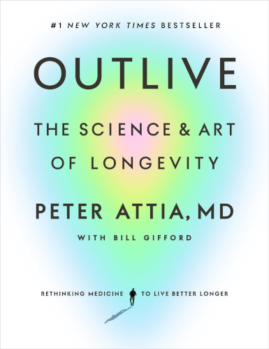

# Outlive

By Peter Attia

> In the dream, I'm trying to catch the falling eggs.
>
> Where are the eggs coming from? There must be a guy up there on top of the building, or on a balcony, just casually tossing them over the rail. But I can't see him, and I'm so busy I barely even have time to think about him. I'm just running around try to catch as many eggs as possible. And I'm failing miserably. Emotion wells up in my body as I realize that no matter now hard I try, I'll never be able to catch all the eggs.
>
> [1]

This dream is an expression of the author's frustration with the state of medicine: "The reality was that nearly all these patients would still die within in a few years. The egg would still hit the ground."

But then, a change of mindset came along.

> It had finally dawned on me that the only way to solve the problem was not to get better at catching the eggs. Instead, we needed to try to stop the guy who was throwing them.
>
> [3]

The author calls this new approach **Medicine 3.0** — not just fixing superficial problems as they appear, but looking deeply into the causes and addressing them as close to the root as possible. This is what *Outlive* is about.

### Sparks

> I believe that our goal should be to act as early as possible, to try to *prevent* people from developing type 2 diabetes and all the other Horsemen. We should be proactive instead of reactive in our approach.
>
> We want to delay or prevent these conditions so that we can live longer *without* disease, rather than lingering *with* disease.
>
> [14]

 

> Assuming that you're not someone who engages in ultrarisky behaviors like BASE jumping, motorcycle racing, or texting and driving, the odds are overwhelming that you will die as a result of one of the chronic diseases of aging that I call the Four Horsemen: heart disease, cancer, neurodegenerative disease, or type 2 diabetes and related metabolic dysfunction.
>
> [10]

 

> Objective -> strategy -> tactics.
>
> [42]

 

#### Caloric Restriction

 

> When *FOXO3* is activated, it in turn activates genes that generally keep our cells healthier. It seems to play an important role in preventing cells from becoming cancerous as well.
>
> *FOXO3* can be activated or suppressed by our own behaviors. For example, when we are slightly deprived of nutrients, or when we are exercising, *FOXO3* tends to be more activated.
>
> [69]

 

> When food is plentiful, mTOR is activated and the cell (or organism) goes into growth mode. When nutrients are scarce, mTOR is suppressed and cells go into a kind of "recycling" mode, breaking down cellular components and generally cleaning house.
>
> [77]

You may have heard the term *autophagy*, which refers to this cellular recycling process.

 

> Studies dating back to the 1930s have found that limiting caloric intake can lengthen the lifespan of a mouse or a rat by anywhere from 15 to 45 percent, depending on the age of onset and degree of restriction. Not only that, but the underfed animals also seem to be markedly healthier for their age, developing fewer spontaneous tumors than normally fed mice.
>
> [81]

 

> Over time — or with disuse — our mitochondria become vulnerable to oxidative stress and genomic damage. Restricting the amount of nutrients that are available, via dietary restriction or exercise, triggers the production of newer, more efficient mitochondria to replace old and damaged ones. These fresh mitochondria help the cell produce more ATP, the cellular energy currency, with the fuel it does have.
>
> [82]

 

> About 75 percent of this glycogen ends up in skeletal muscle and the other 25 percent oes to the liver, although this ratio can vary. An adult male can typically store a total of about 1,600 calories worth of glycogen between these two sites, or about enough energy for two hours of vigorous endurance exercise.
>
> [96]

 

#### Cardiovascular Disease

 

> It doesn't take much visceral fat [fat in your internal organs] to cause problems.
>
> This is why I insist my patients undergo a DEXA scan annually — and I am far more interested in their visceral fat than their total body fat.
>
> [100]

 

> This means keeping watch for the earliest signs of [metabolic syndrome] trouble. I watch the ratio of triglycerides to HDL cholesterol (it should be less than 2:1 or better yet, less than 1:1).
>
> [108]

 

> HDL particles are wrapped in a type of molecule called apolipoprotein A (or apoA), while LDL is encased in apolipoprotein B (or apoB). Every single lipoprotein that contributes to atherosclerosis – not only in LDL but several others – carries this apoB protein signature.
>
> [116]

 

> "There's no connection whatsoever between cholesterol in food and cholesterol in blood."
>
> [118]

 

> When a patient comes to me and says their father or grandfather or aunt, or all three, died of "premature" heart disease, elevated Lp(a) is the first thing I look for. It is the most prevalent hereditary risk factor for heart disease.
>
> [129]

 

> About a third to half of people who consume high amounts of saturated fats will experience a dramatic *increase* in apoB particles, which we obviously don't want. Monounsaturated fats, found in high quantities in extra virgin olive oil, macadamia nuts, and avocados (among other foods), do not have this effect.
>
> The point is not necessarily to limit fat overall but to shift to fats that promote a better lipid profile.
>
> [133]

 

> This encapsulates the fundamental difference between Medicine 2.0 and Medicine 3.0 when it comes to cardiovascular disease. The former views prevention largely as a matter of managing relatively short-term risk. Medicine 3.0 takes a much longer view – and more importantly seeks to identify and eliminate the *primary causative agent* in the disease process: apoB.
>
> Once you understand that apoB particles – LDL, VLDL, Lp(a) – are *causally* linked to ASCVD [atherosclerotic cardiovascular disease], the game completely changes. The only way to stop the disease is to remove the cause, and the best time to do that is now.
>
> [137]

 

#### Cancer

 

> The final and perhaps most important tool in our anticancer arsenal is early, aggressive screening. This remains a controversial topic, but the evidence is overwhelming that catching cancer early is almost always net beneficial.
>
> The ten-year survival rate for patients with metastatic cancer is virtually the same as it was fifty years ago: **zero**. We need to do more than hope for novel therapies.
>
> When cancers are detected early stage, in stage I, the survival rates skyrocket. I would go so far ast o argue that early detection is our *best* hope for radically reducing cancer mortality.
>
> [165]

 

#### The Brain and Cognition

 

> The more of these networks and subnetworks [in our brain] that we have built up over our lifetime, via education or experience, or by developing complex skills such as speaking a foreign language or playing a musical instrument, the more resistant to cognitive decline we will tend to be. The brain can continue functioning more or less normally, even as some of these networks begin to fail. This is called "cognitive reserve", and it has been shown to help some patients to resist the symptoms of Alzheimer's disease. It seems to take longer for the disease to affect their ability to function.
>
> [192]

 

> There is a parallel concept known as "movement reserve" that becomes relevant with Parkinson's disease. People with better movement patterns, and a longer history of moving their bodies, such as trained or frequent athletes, tend to resist or slow the progression of the disease as compared to sedentary people. This is also why movement and exercise, not merely aerobic exercise but also more complex activities like boxing workouts, are a primary treatment/prevention strategy for Parkinson's.
>
> [192]

 

> If we lack new sources of glucose, the brain's preferred fuel, the liver converts our fat into ketone bodies, as an alternative energy source that can sustain us for a very long time, depending on the extent of our fat stores. When our fat runs out, we will begin to consume our own muscle tissue, then our other organs, and even bone, all in order to keep the brain running at all costs. The brain is the last thing to shut off.
>
> [195]

 

> Endurance exercise produces factors that directly target regions of the brain responsible for cognition and memory. It also helps lower oxidative stress.
>
> [201]

 

> The best interpretation I can draw from the literature suggests that at least four sessions per week, of at least twenty minutes per session, at 179 degrees Fahrenheit (82 degrees Celsius) or hotter seems to be the sweet spot to reduce the risk of Alzheimer's by about 65 percent (and the risk of ASCVD by 50 percent).
>
> [204]

 

> 1. *What's good for the heart is good for the brain.* Vascular health is crucial to brain health.
> 2. *What's good for the liver is good for the brain.* Metabolic health is crucial to brain health.
> 3. *Time is key.* We need to think about prevention early.
> 4. *Our most powerful tool for preventing cognitive decline is exercise.*
>
> [205]

 

#### Cardiorespiratory Fitness

 

> It turns out that peak aerobic cardiorespiratory fitness, measured in terms of VO2 max, is perhaps the single most powerful marker for longevity. VO2 max represents the maximum rate at which a person can utilize oxygen.
>
> [220]

 

> Someone in the bottom quartile of VO2 max for their age group is nearly four times likelier to die than someone in the top quartile.
>
> [221]

 

> "Cardiorespiratory fitness is inversely associated with long-term mortality *with no observed upper limit of benefit*."
>
> [223]

 

> Increasing your VO2 max *by any amount* is going to improve your life, not only in terms of how long you live but also how well you live, today and in the future. Improving your VO2 max from the very bottom quartile to the quartile above is associated with almost a 50 percent reduction in all-cause mortality. I believe that almost anyone is capable of achieving this – and they should, because the alternative is so unacceptable.
>
> [247]

 

> [Suggested VO2 max workout...]
>
> I do these workouts on my road bike, mounted to a stationary trainer, or on a rowing machine, but running on a treadmill (or a track) could also work. The tried-and-true formula for these intervals is to go four minutes at the maximum pace you can sustain for this amount of time. Then ride or jog four minutes easy. Repeat this four to six times and cool down.
>
> [250]

You might also be interested in [this](https://www.youtube.com/watch?v=sJ_Udumb3ig) workout, which puts an interesting twist on the same basic formula. Pick a duration for your interval, which we'll call *N* minutes (the video uses two-minute intervals, but other people also recommend four-minute intervals, which matches the number in this book), then do the following:

1. Run/cycle/row as far as you can in *N* minutes. Note how far you went. Rest for *N* minutes.
2. Run/cycle/row the *distance* reached in set 1 as fast as you can. Try to beat your time from set 1. Note your time. Rest for *N* minutes.
3. Run/cycle/row as far as you can in the *time* achieved in set 2. This is the last set, so really go all-out. Try to beat your distance from the previous sets.

(Of course, this is essentially just 3 x *N*-minute high-intensity intervals, but you might find it a bit more engaging to have a different goal for each interval.)

 

> At a deeper biochemical level, exercise really does act like a drug. To be more precise, it prompts the body to produce its own, endogenous drug-like chemicals. When we are exercising, our muscles generate molecules known as cytokines that send signals to other parts of our bodies, helping to strengthen our immune system and stimulate the growth of new muscle and stronger bones. Endurance exercise such as running or cycling helps generate another potent molecule called brain-derived neurotrophic factor, or BDNF, that improves the health and function of the hippocampus, a part of the brain that plays an essential role in memory.
>
> [225]

 

> Typically, someone working at a lower relative intensity will be burning more fat, while at higher intensities they would rely more on glucose. The healthier and more efficient your mitochondria, the greater your ability to utilize fat.
>
> [238]

 

#### The Centenarian Decathlon and Health in Old Age

 

> What in the world is the Centenarian Decathlon?
>
> Think of the Centenarian Decathlon as the ten most important physical tasks you will want to be able to do for the rest of your life.
>
> [231]

> To lift that twenty-point suitcase overhead when you are older means doing so with forty or fifty points now. To be able to climb four flights of stairs in your eighties means you should be able to pretty much sprint up those same stairs today. In every case, you need to be doing *much more now* to armor yourself against the natural and precipitous decline in strength and aerobic capacity that you will undergo as you age.
>
> [232]

> I suggest you join me and start *training*, with a very specific purpose, which is to be kick-ass one-hundred-year-olds.
>
> As Centenarian Decathletes, we are no longer training for a specific event, but to become a different sort of athlete altogether: an athlete of life.

 

> Seniors with the least muscle mass are at the greatest risk of dying from all causes. One Chilean study looked at about one thousand men and four hundred women, with an average age of seventy-four at enrollment. [...] After twelve years, approximately 50 percent of those in the lowest quartile [of muscle mass] were dead, compared to only 20 percent of those in the highest quartile.
>
> Muscle helps us survive old age.
>
> [226]

 

> A study of twelve healthy volunteers with an average age of sixty-seven found that after just ten days of bed rest, which is about what a person would experience from a major illness or orthopedic surgery, study participants lost an average of 3.3 pounds of lean mass (muscle). That's substantial, and it shows just how dangerous inactivity can be.
>
> Regaining that muscle, once we've gotten to this state, is no easy task. One study looked at sixty-two frail seniors (average age seventy-eight) who engaged in a program of strength training and found that even after six months of pure strength training, half of the subjects did not gain *any* muscle mass.
>
> [253]

 

#### Weight Training

 

> If you are struggling to get through your workout, then you are likely resorting to your body's own "cheats", your ingrained but potentially dangerous movement patterns.
>
> [265]

I have a deeply programmed attitude that when doing a set of lifts, the set ends as soon as I feel my body start to cheat the form on a single rep (not when I'm actually so tired I can't move the weight anymore).

If you want to get the feeling of an all-out give-everything-you-got set while avoiding the dangers of cheated form, try drop sets. Start with your set as normal, but once you can't do a clean-form rep, immediately grab a lighter weight and keep going. Repeat this several times. You'll find with this method, you can reach a point where you're struggling to lift what you would normally consider a trivially light weight (but you certainly don't have to go this far). This will definitely make you very fatigued and sore.

 

> Stability is tricky to define precisely, but we intuitively know what it is. A technical definition might be: stability is the subconscious ability to harness, decelerate, or stop force.
>
> [266]

> We want to think about how efficiently and safely force can be transmitted *through* something [a joint].
>
> When stability is lacking, all that extra force has to go somewhere. If my street car's powerful engine is transmitting only part of its power to the road through the tires, the remainder of that energy is leaking out, lost to friction and nonproductive motion, primarily. Parts of the car that should not be moving relative to each other are doing just that.
>
> When this happens in our bodies, this force dissipation leaks out via the path of least resistance – typically via joints like knees, elbows, and shoulders, and/or the spine, and or all of which will give out at some point. Joint injuries are almost always the result of this kind of energy leak.
>
> [267]

 

> Back when we carried things, we had to have strong hands to survive. No longer.
>
> Because we are not "training" grip in our daily lives, we must be deliberate in our workouts, focusing on initiating movement with the hands and utilizing all the fingers with our upper body movements.
>
> [282]

 

> I would urge you to film yourself working out from time to time, to compare what you think you are doing to what you are actually doing with your body.
>
> [284]

 

> *The patient has not failed the treatment. The treatment has failed the patient.*
>
> [320]

What's the best diet? The one that you will follow.

What's the best exercise plan? The one that you will stick to.

When I am designing an exercise or eating plan, if I don't adhere to it, I don't consider that a failure of willpower of the person, I consider it a failure of *engineering* the optimal plan. At this point, it's back to the drawing board: What characteristics of the plan made it difficult to adhere to? Wow can I engineer a new plan that avoids these problems?

 

#### Nutrition

 

> Everyone tends to be more insulin sensitive in the morning than in the evening, so it makes sense to front-load our carb consumption earlier in the day.
>
> [327]

(Remember, insulin helps manage what your body does with carbs. "Insulin sensitive" means that process works more effectively.)

 

> Sleep disruption or reduction dramatically impairs glucose homeostasis over time. From years of experience with my own CGM [continuous glucose monitor] and that of my patients, it still amazes me how much even one night of horrible sleep cripples our ability to dispose of glucose the next day.
>
> [327]

 

> We know that elevated blood glucose, over a long enough period of time, amplifies the risk of all the Horsemen. But there is also evidence suggesting that repeated blood glucose spikes, and the accompanying rise(s) in insulin, may have negative consequences in and of themselves.
>
> [322]

 

> The more refined the carb, the faster and higher the glucose spike. Less processed carbohydrates and those with more fiber, on the other hand, blunt the glucose impact.
>
> [328]

 

> If you consume more protein than you can synthesize into lean mass, you will simply excrete the excess into your urine as urea.
>
> [331]

 

> How much protein do we actually need? It varies from person to person. In my patients I typically set 1.6 g/kg/day as the minimum.
>
> So if someone weights 180 pounds, they need to consume a minimum of 130 grams of protein per day, and ideally closer to 180 grams.
>
> Most people don't need to worry about consuming too much protein. It would require an overwhelming effort to eat more than 3.7 g/kg/day, defined as the safe upper limit of protein consumption.
>
> [332]

 

> This kind of fasting is called "hypocaloric" because you are not truly fasting in the sense of eating no food at all. You are eating just enough to quell the worst hunger pangs, but not so much that your body thinks you are fully fed.
>
> During his fasting week, a typical day's menu might consist of a salad with light dressing, an avocado, and some macadamia nuts or olives. He was surprised at how good he felt. "It wasn't as horrific as I thought it was going to be," he told me later. "After day three, the hunger disappears."
>
> [345]

 

#### Sleep

 

> No fewer than nine different studies have found that sleep deprivation increases insulin resistance [a bad thing] by up to a third.
>
> [357]

(*Insulin* helps move glucose to where it's needed and maintain proper levels of glucose in your blood. *Insulin resistance* means your insulin system isn't working, and so your body cannot healthily manage the carbohydrates and sugar you eat.)

 

> Researchers have observed a direct, linear relationship between how much deep sleep we get in a given night and how well we perform on a memory test the next day.
>
> [361]

 

> [A] very important function of REM sleep is to help us process our emotional memories, helping separate our emotions from the memory of the negative (or positive) experience that triggered those emotions. This is why, if we go to bed upset about something, it almost always seems better in the morning. We remember the event but (eventually) forget the pain that accompanied it.
>
> [362]

 

> Deep sleep, on the other hand, seems to be essential to the very health of our brain as an organ. While we are in deep sleep, the brain activates a kind of internal waste disposal system tht allows cerebrospinal fluid to flood in between the neurons and sweep away intercellular junk. This cleansing process flushes out detritus, including both amyloid-beta and tau, the two proteins linked to neurodegeneration.
>
> [362]

 

> *How to Improve Your Sleep*
>
> 1. Don't drink any alcohol, period.
> 2. Don't eat anything less than three hours before bedtime. It's best to go to bed with just a little bit of hunger.
> 3. Abstain from stimulating electronics, beginning two hours before bed. Try to avoid anything involving a screen.
> 4. For at least one hour before bed, avoid doing anything that is anxiety-producing or stimulating, such as reading work email or, God help you, checking social media.
> 5. For folks who have access, spend time in a sauna or hot tub prior to bed. (A hot bath or shower works too.)
> 6. The room temperature should be cool, ideally in the midsixties [Fahrenheit].
> 7. Darken the room completely. Make it dark enough that you can't see your hand in front of your face with your eyes open, if possible. If this is not possible, use an eye shade.
> 8. Give yourself enough time to sleep – what sleep scientists call a *sleep opportunity*. This means going to bed at least eight hours before you need to wake up, preferably nine.
> 9. Fix your wake-up time – and don't deviate from it, even on weekends.
> 10. Don't obsess over your sleep. If you need an alarm clock, make sure it's turned away from you so you can't see the numbers.
>
> [374]

 

There are a *lot* of common themes between the ideas here and those in Matt Walker's book, [*Why We Sleep*](why_we_sleep.md). I highly recommend that book if you'd like to learn more about sleep.

 

#### Personal Growth

 

> A 2019 study provides an elegant demonstration of the principle that setbacks can be net positive. The researchers looked at junior scientists who had applied for NIH grants and separated them into two groups: One group had scored just above the threshold for funding, while the other had scored just below the funding line, meaning their grants were not funded. While [those in the second group] were more likely to drop out of science in the immediate aftermath, those who stuck with it eventually outperformed their peers who had received funding on their first try. The early setback had not impaired their careers but may have had an opposite effect.
>
> [387]

 

> If you take nothing else from my story, take this: *If I can change, you can change*. All of this has to begin with the simple belief that real change is possible. That's the most important step. I believed I was the most horrible, incorrigible, miserable son of a bitch that was ever shat into civilization. For as long as I could remember, I believed that I was defective and that my flaws were hard-wired. Unchangeable. Only when I at least entertained the notion that maybe I was not actually a monster was I able to start chipping away at the narrative that had nearly destroyed my life and everyone in my wake.
>
> This is the key step. You have to believe you can change – and that you deserve better.
>
> [407]

 

> Here's to staying young, even as we grow older.
>
> [411]

 

---

 

Return to the [Book List](Readme.md#book-list).
