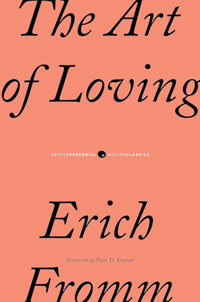

# The Art of Loving

By Erich Fromm

> *Is love an art? Then it requires knowledge and effort.* Or is love a pleasant sensation, which to experience is a matter of chance, something one "falls into" if one is lucky? This little book is based on the former premise, while undoubtedly the majority of people today [1956] believe the latter.

While this premise may sound more obvious now, this book was certainly revolutionary in its time — and it contains insights that are strikingly wise and not widely known or taught, even now. I learned a great deal from this book, and its wisdom continues to play a central role in how I think of love to this day.

### Sparks

> They take the intensity of the infatuation, this being "crazy" about each other, for proof of the intensity of their love, while it may only prove the degree of their preceding loneliness.
>
> [4]

 

> Love is an activity, not a passive affect. In the most general way, the active character of love can be described by stating that love is primarily *giving*, not receiving.
>
> [21]

 

> Beyond the element of giving, the active character of love becomes evident in the fact that it always implies certain basic elements, common to all forms of love. These are *care*, *responsibility*, *respect*, and *knowledge*.
>
> [24]

 

> Love is not primarily a relationship to a specific person; it is an *attitude*, an *orientation* of *character* which determines the relatedness of a person to the world as a whole.
>
> [43]

 

> To love somebody is not just a strong feeling — it is a decision, it is a judgment, it is a promise. If love were only a feeling, there would be no basis for the promise to love each other forever.
>
> [52]

 

> *Selfishness and self-love, far from being identical, are actually opposites.* The selfish person does not love himself too much but too little; in fact he hates himself.
>
> *It is true that selfish persons are incapable of loving others, but they are not capable of loving themselves either.*
>
> [56]

 

> Modern capitalism needs men who cooperate smoothly and in large numbers; who want to consume more and more; and whose tastes are standardized and can be easily influenced and anticipated.
>
> What is the outcome? Modern man is alienated from himself, from his fellow men, and from nature.
>
> [79]

 

> The study of the most frequent sexual problems — frigidity in women and psychic impotence in men — shows that the cause does not lie in a lack of knowledge of the right technique, but in the inhibitions which make it impossible to love.
>
> [82]

 

> [On "men who in their emotional development have remained stuck in an infantile attachment to mother"...]
>
> Such men frequently are quite affectionate and charming if they try to induce a woman to love them, and even after they have succeeded in this. But their relationship to the woman remains superficial and irresponsible. Their aim is to be loved, not to love.
>
> [88]

 

> A form of pseudo-love which is not infrequent and is often experienced as the "great love" is *idolatrous love* [idolizing the loved person].
>
> [92]

 

> How many engaged or newly married couples dream of their bliss of love to take place in the future, while at the very moment at which they live they are already beginning to be bored with each other? This tendency coincides with a general attitude characteristic of modern man. He lives in the past or in the future, but not in the present.
>
> [93]

(Yes, this book was written in the 1950s. And yet, these words ring even truer now than they did at the time of writing.)

 

> Real conflicts between two people those which do not serve to cover up or to project, but which are experienced on the deep level of inner reality to which they belong, are not destructive. They lead to clarification, they produce a catharsis from which both persons emerge with more knowledge and more strength.
>
> [95]

 

> You do many things at once; you read, listen to the radio, talk, smoke, eat, drink. You are the consumer with the open mouth, eager and ready to swallow everything — pictures, liquor, knowledge. This lack of concentration is clearly shown in our difficulty in being alone with ourselves. To sit still, without talking, smoking, reading, drinking, is impossible for most people.
>
> [101]

The only sign of datedness here is the mention of radio and smoking — replace those with YouTube and social media and this may as well have been written yesterday.

 

> It is one of the unfortunate aspects of our Western concept of discipline (as of every virtue) that its practice is supposed to be somewhat painful and only if it is painful can it be "good". The East has recognized long ago that that which is good for man must also be agreeable, even though at the beginning some resistances must be overcome.
>
> [103]

 

> Only the person who has faith in himself is able to be faithful to others, because only he can be sure that he will be the same at a future time as he is today and, therefore, that he will feel and act as he now expects to.
>
> [114]

 

> If it is true, as I have tried to show, that love is the only sane and satisfactory answer to the problem of human existence, then any society which excludes the development of love must in the long run perish of its own contradiction with the basic necessities of human nature.
>
> [123]

 

---

 

Return to the [Book List](Readme.md#book-list).
