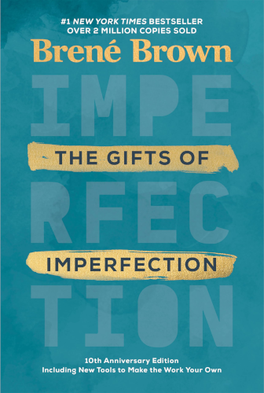

# The Gifts of Imperfection

By Brene Brown

Imperfection is at the core of humanity, and shame is the demon who feasts on our fear that others will look down on us for our imperfections. *The Gifts of Imperfection* teaches you how to overcome shame through shame resilience practice, which will help you eliminate your feelings of isolation and fear of judgment, and instead find courage and connection.

What is the bridge between shame and connection? *Vulnerability*. To get from shame to connection — and ultimately to joy — one must embrace vulnerability:

> Courage is telling our story, not being immune to criticism. Staying vulnerable is a risk we have to take if we want to experience connection.
>
> [74]

### Sparks

> Creativity is the engine that drives integration; it helps us transform knowledge into practice.
>
> [xvi]

If you want to solidify something you're learning, use it in a creative endeavor.

 

> I started saying *no* rather than *sure* (and being resentful and pissed off later).
>
> [xxvii]

I read something very similar in a book called *Less Is More* by Robin James: If you say yes to everything, you spread yourself too thin. To overcome this tendency, make a list of all the things you said "yes" to recently that you later regretted. Keep these examples in mind before you reflexively say "yes" to the next thing someone asks of you.

 

> "It's like you learn to swim by swimming. You learn courage by couraging."
>
> [11]

 

> The most dangerous thing to do after a shaming experience is hide or bury our story. When we bury our story, the shame metastasizes.
>
> [15]

 

> Until we can receive with an open heart, we are never really giving with an open heart. When we attach judgment to receiving help, we knowingly or unknowingly attach judgment to giving help.
>
> [31]

 

> So many of us have [...] a long list of worthiness prerequisites:
>
> * I'll be worth when I lose twenty pounds.
> * ...
>
> Here's what is truly at the *heart* of wholeheartedness: Worthy now. Not if. Not when. We are worthy of love and belonging *now*.
>
> [33]

 

> Here are the first three things you need to know about shame:
>
> 1. We all have it.
> 2. We're all afraid to talk about shame.
> 3. The less we talk about shame, the more control it has over our lives.
>
> Shame keeps worthiness away by convincing us that owning our stores will lead to people thinking less of us. Shame is all about fear.
>
> [53]

So don't let shame convince you! The evidence is on your side: being vulnerable (in a thoughtful way) almost always inspires respect.

 

> [On the barrage of messages we receive from ads, movies, music, and so on...]
>
> 1. Is what I'm seeing real? Do these images convey real life or fantasy?
> 2. Do these images reflect healthy, wholehearted living?
> 3. Who benefits by my seeing these images and feeling bad about myself? *Hint: This is ALWAYS about money and/or control.*
>
> [91]

 

> [Happiness versus joy]
>
> Happiness is tied to circumstance and joyfulness is tied to spirit and gratitude.
>
> [104]

 

> The comparison mandate becomes this crushing paradox of "Fit in and stand out!"
>
> "Be just like everyone else, but better."
>
> [122]

 

> One of the best things that we've ever done in our family is making the "ingredients for joy and meaning" list. I encourage you to sit down and make a list of the specific conditions that are in place when everything feels good in your life. Then check that list against your to-do list and your to-accomplish list. It might surprise you.
>
> [133]

 

> "Don't ask what the world needs. Ask what makes you come alive, and go do it. Because what the world needs is people who have come alive."
>
> [147]

 

---

 

Return to the [Book List](Readme.md#book-list).
