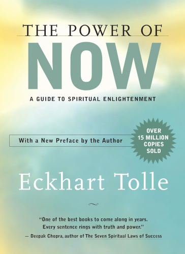

# The Power of Now

By Eckhart Tolle

The wisdom of Eckhart Tolle has a unique character of the utmost profundity and abstractness, combined with exceptional preciseness and succinctness of language. His books are powerful, inspiring, calming, meditative, and certainly impossible to be a waste of time.

*The Power of Now* shows us that there can be no problems while we are fully present here and now. Our suffering comes from being in the past, or the future, or some other place — in short, from our imagination.

### Sparks

> Not being able to stop thinking is a dreadful affliciton, but we don't realize this because almost everybody is suffering from it, so it is considered normal.
>
> [12]

 

> The greater part of human pain is unnecessary. It is self-created as long as the unobserved mind runs your life.
>
> The pain that you create now is always some form of nonacceptance, some form of unconscious resistance to what *is*.
>
> [27]

 

> "Unconscious," the way that I use the word here, means to be identified with some mental or emotional pattern. It implies a complete absence of the watcher.
>
> [33]

 

> You can always cope with the present moment, but you cannot cope with something that is only a mind projection — you cannot cope with the future.
>
> [35]

 

> Power over others is weakness disguised as strength.
>
> [36]

 

> Here is the key: End the delusion of time. Time and mind are inseparable. Remove time from the mind and it stops — unless you choose to use it.
>
> [40]

 

> The moment you realize you are not present, you *are* present. Whenever you are able to observe your mind, you are no longer trapped in it. Another factor has come in, something that is not of the mind: the witnessing presence.
>
> [45]

 

> All negativity is caused by an accumulation of psychological time and denial of the present. Unease, anxiety, tension, stress, worry — all forms of fear — are caused by too much future, and not enough presence. Guilt, regret, resentment, grievances, sadness, bitterness, and all forms of nonforgiveness are caused by too much past, and not enough presence.
>
> [50]

 

> Problems are mind-made and need time to survive. They cannot survive in the actuality of the Now.
>
> Focus your attention on the Now and tell me what problem you have at this moment.
>
> [53]

 

> Loss of Now is loss of Being.
>
> [59]

 

> Anything unconscious dissolves when you shine the light of consciousness on it.
>
> [63]

 

> Try a little experiment. Close your eyes and say to yourself: "I wonder what my next thought is going to be." Then become very alert and wait for the next thought. Be like a cat watching a mouse hole. What thought is going to come out of the mouse hole? Try it now.
>
> [77]

(You may find that you end up waiting quite a while for a thought to finally appear. This is precisely the point. This is the state of intense presence.)

 

> Inhabit your body fully. Always have some of your attention in the inner energy field of your body. Feel the body from within, so to speak. Body awareness keeps you present. It anchors you in the Now.
>
> [78]

 

> The key is to be in a state of permanent connectedness with your inner body — to feel it at all times. This will rapidly deepen and transform your life.
>
> [97]

 

> Don't just think with your head, think with your whole body.
>
> [105]

 

> Get in touch with the energy field of the inner body, be intensely present, disidentify from the mind, surrender to what *is*; these are all portals you can use — but you only need to use one.
>
> [112]

 

> Every portal is a portal of death, the death of the false self.
>
> The end of illusion — that's all death is. It's only painful as long as you cling to illusion.
>
> [119]

 

> The greatest catalyst for change in a relationship is complete acceptance of your partner as he or she is, without needing to judge or change them in any way.
>
> [128]

 

> When you *know* you are not at peace, your knowing creates a still space that surrounds your nonpeace in a loving and tender embrace and then transmutes your nonpeace into peace.
>
> [131]

 

> The whole world seems like waves or ripples on the surface of a vast and deep ocean. You are that ocean and, of course, you are also a ripple, but a ripple that has realized its true identity as the ocean, and compared to that vastness and depth, the world of waves and ripples is not all that important.
>
> [143]

 

> The ultimate effect of all the evil and suffering in the world is that it will force humans into realizing who they are beyond name and form. Thus, what we perceive as evil from our limited perspective is actually part of the higher good that has no opposite.
>
> [149]

 

> All inner resistance is experienced as negativity in one form or another. All negativity *is* resistance.
>
> [156]

 

> All this can be transformed into spiritual practice. Feel yourself becoming transparent, as it were, without the solidity of a material body. Now allow the noise, or whatever causes a negative reaction, to pass right through you. It is no longer hitting a solid "wall" inside you. As I said, practice with little things first. The car alarm, the dog barking, the children screaming, the traffic jam. Instead of having a wall of resistance inside you that gets constantly and painfully hit by things that "should not be happening," let everything pass through you.
>
> [160]

 

> Anything you accept fully will take you into peace. This is the miracle of surrender.
>
> [161]

 

> When you are fully present and people around you manifest unconscious behavior, you won't feel the need to react to it, so you don't give it any reality. Your peace is so vast and deep that anything that is not peace disappears into it as if it had never existed.
>
> You become the "light of the world," an emanation of pure consciousness, and so you eliminate suffering on the level of cause. You eliminate unconsciousness from the world.
>
> [167]

 

> Without a profound change in human consciousness, the world's suffering is a bottomless pit.
>
> [168]

 

> You say that you are conscious of your unhappy feelings but the truth is that you are identified with them and keep the process alive through compulsive thinking.
>
> [176]

 

> Become an alchemist. Transmute base metal into gold, suffering into consciousness, disaster into enlightenment.
>
> [182]

 

---

 

Return to the [Book List](Readme.md#book-list).
