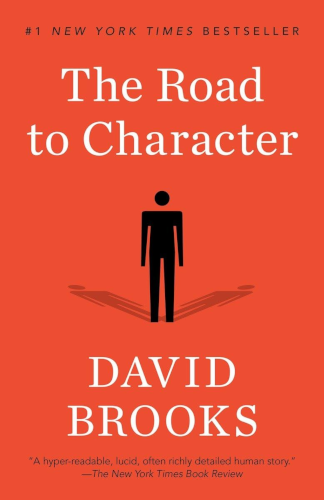

# The Road to Character

By David Brooks

This book investigates the lives of a selection of people from a variety of backgrounds who have endured tremendous hardships, challenges, and struggles, and have yet somehow accomplished amazing things — people who you might say were dealt a losing hand, and turned it into something magnificent.

How did they do this? What attitudes, behaviors, and character qualities were common among all of these people? What can we learn from their journeys through adversity into accomplishment? That's what this book aims to find out.

### Sparks

> The inner struggle against one's own weaknesses is the central drama of life.
>
> "The beginning of worth-while living is thus the confrontation with ourselves."
>
> [10]

 

> There is one pattern that recurs: They had to go down to go up. They had to descend into the valley of humility to climb to the heights of character.
>
> The road to character often involves moments of moral crisis, confrontation, and recovery. When they were in a crucible moment, they suddenly had a greater ability to see their own nature. The everyday self-deceptions and illusions of self-mastery were shattered.
>
> [13]

 

> "Anybody who proposes to do good must not expect people to roll any stones out of his way, and must calmly accept his lot even if they roll a few more onto it."
>
> [23]

 

> When modern culture tries to replace *sin* with ideas like *error* or *insensitivity*, or tries to banish words like "virtue", "character", "evil", and "vice" altogether, that doesn't make life any less moral; it just means we have obscured the inescapable moral core of life with shallow language. It just means we think and talk about these choices less clearly, and thus become increasingly blind to the moral stakes of everyday life.
>
> [34]

 

> People who endure suffering are taken beneath the routine busyness of life and find they are not who they believed themselves to be.
>
> [94]

 

> The higher you go in life, the fewer people there are to offer honest feedback or restrain your unpleasant traits.
>
> [111]

 

> Nonviolence allowed the biblical realists to aggressively expose the villainy of their foes, to make their enemies' sins work against [themselves] as [their sins] were exposed in ever more brutal forms. They compelled their foes to commit evil deeds because they themselves were willing to absorb evil.
>
> [147]

 

> Love is a surrender. You expose your deepest vulnerabilities and give up your illusions of self-mastery.
>
> Love decenters the self. Love makes other people more vivid to you than you are to yourself.
>
> [171]

> Love impels people to service.
>
> Love ennobles and transforms. In no other state do people so often live as we want them to live.
>
> [174]

 

> We so fear exclusion from the group that we are willing to do things that we would find unconscionable in other circumstances. When unattached to the right ends, communities can be more barbarous than individuals.
>
> [196]

 

> If you think you can organize your own salvation you are magnifying the very sin that keeps you from it. To believe that you can be captain of your own life is to suffer the sin of pride.
>
> [199]

 

> In Augustine's view, people do not get what they deserve; life would be hellish if they did. Instead people get much more than they deserve.
>
> [206]

 

> Knowledge is not enough for tranquility and goodness, because it doesn't contain the motivation to be good. Only love impels action. We don't become better because we acquire new information. We become better because we acquire better loves.
>
> Education is a process of love formation. When you go to a school, it should offer you new things to love.
>
> [211]

 

> *How small, of all that human hearts endure,
> That part which laws and kings can cause or cure.*
>
> [223]

 

> Read over your compositions, and wherever you meet with a passage you think is particularly fine, strike it out.
>
> [225]

I was highly dubious of this when I first read this, but it has stuck deeply in my mind ever since, and proven itself unexpectedly wise.

 

> "To strive with difficulties, and to conquer them, is the highest human felicity."
>
> [238]

 

> Some parents unconsciously shape their expressions of love to steer their children toward behavior they think will lead to achievement and happiness.
>
> Parental love becomes merit-based. It is not simply "I love you." It is "I love you when you stay on my balance beam."
>
> [255]

(And some parents even do this consciously. Either way, the point is that this is very unhealthy for the child's development.)

 

> People have become less empathetic.
>
> A University of Michigan study found that today's college students score 40 percent lower than their predecessors in the 1970s in their ability to understand what another person is feeling. The biggest drop came in the years after 2000.
>
> [257]

This book was published in 2015. I wouldn't be surprised if the effect has become even more pronounced in the most recent decade, with the majority of people's lives utterly dissolving into their smartphones.

 

**Excerpts from the *Humility Code*** (bold added by me):

> 1. We don't live for happiness, we live for holiness. All human beings seek to live lives not just of pleasure, but of purpose, righteousness, and virtue.
>
> 3. Although we are flawed creatures, we are also splendidly endowed. We do sin, but we also have the capacity to recognize sin,to feel ashamed of sin, and to overcome sin. **We thus have the capacity to struggle with ourselves. There is something heroic about a person in struggle with herself.**
>
> 4. In the struggle against your own weakness, humility is the greatest virtue. Humility reminds you that you are not the center of the universe, but you serve a larger order.
>
> 5.  Pride blinds us to our own weaknesses and misleads us into thinking we are better than we are. Pride makes us more certain and close-minded than we should be.
>
> 6. Once the necessities for survival are satisfied, **the struggle against sin and for virtue is the central drama of life**. No external conflict is as consequential or as dramatic as the inner campaign against your own deficiencies.
>
> 8. The things that lead us astray are short term — lust, fear, vanity, gluttony. The things we call character endure over the long term — courage, honesty, humility.
>
> 9. No person can achieve self-mastery on his or her own.
>
> 11. Defeating weakness often means quieting the self. Only by quieting the self, by muting the sound of your own ego, can you see the world clearly.
>
> 12. Wisdom starts with epistemological modesty. The world is immeasurably complex and the private stock of reason is small.
>
> 13. No good life is possible unless it is organized around vocation. **What problem is addressed by an activity you intrinsically enjoy?**
>
> 15. Maturity is earned not by being better than other people at something, but by being better than you used to be.
>
> [266]

---

 

Return to the [Book List](Readme.md#book-list).
