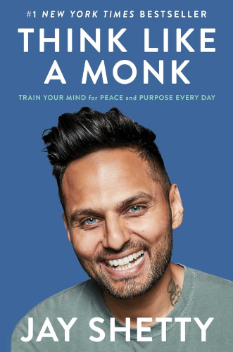

# Think Like A Monk

By Jay Shetty

From the book's own introduction:

> Monks can withstand temptations, refrain from criticizing, deal with pain and anxiety, quiet the ego, and build lives that brim with purpose and meaning. Why shouldn't we learn from the calmest, happiest, most purposeful people on earth?
>
> Monks weren't born monks. They're people from all sorts of backgrounds who've chosen to transform themselves. I know monks who were in finance and in rock bands. [...] They grow up in schools, towns, and cities just like you. Becoming a monk is a mindset that anyone can adopt.
>
> [xii]

> What struck me most when I studied monk philosophy is that in the last three thousand years, humans haven't really changed. I was surprised and impressed to find that the monk teachings talk about forgiveness, energy, intentions, living with purpose, and other topics in ways that are as resonant today as they must have been when they were written.
>
> [xv]

### Sparks

#### Identity

> "I am not what I think I am, and I am not what you think I am. I am what I think you think I am."
>
> [3]

 

> Try This: Where did your values come from?
>
> It can be hard to perceive the effect these casual influences have on us. Values are abstract, elusive, and the world we live in constantly pushes blatant and subliminal suggestions as to what we should want, how we should live, and how we form our ideas of who we are.
>
> Write down some of the values that shape your life. Next to each, write the origin. Put a checkmark next to each value that you truly share.
>
> [10]

 

> When we tune out the opinions, expectations, and obligations of the world around us, we begin to hear ourselves.
>
> [11]

 

> No matter what you *think* your values are, your actions tell the real story. What we do with our spare time shows what we value. For instance, you might put spending time with your family at the top of your list of values, but if you spend all your free time playing golf, your actions don't match your values, and you need to do some self-examination.
>
> [12]

 

> Ask yourself a question: When I spend time with this person or group, do I feel like I'm getting closer to or further away from who I want to be?
>
> [18]

 

#### Negativity

> "Do not give your attention to what others do or fail to do; give it to what you do or fail to do."
>
> [21]

 

> "There is no commandment that says we have to be upset by the way other people treat us. The reason we are upset is because we have an emotional program that says [I should be upset now]."
>
> [28]

 

> "Letting go gives us freedom, and freedom is the only condition for happiness."
>
> [29]

 

> If I sold more apples than you did yesterday, but you sold more today, this says nothing about whether I'm improving as an apple seller. The more we define ourselves in relation to the people around us, the more lost we are.
>
> [31]

 

> [In English,] we don't have a word for experiencing vicarious joy — joy on behalf of other people. Perhaps this is a sign that we all need to work on it. *Mudita* is the principle of taking sympathetic or unselfish joy in the good fortune of others.
>
> [37]

 

> Try this: Reverse Envy
>
> Make a list of five people you care about, but also feel competitive with. Come up with at least one reason that you're envious of each one: something they've achieved, something they're better at, something that's gone well for them.
>
> Did that achievement actually take anything away from you?
>
> Now think about how it benefitted your friend. Visualize everything good that has come to them from this achievement. Would you want to take any of these things away if you could?
>
> [38]

This is a real mindset-changer. Try this now, even just for one person. I'm not even very competitive, and I felt so much happier around the people involved after doing this exercise.

 

> Forgiveness actually conserves energy. Forgiveness eases stress, because we no longer recycle the angry thoughts, both conscious and subconscious, that stressed us out in the first place.
>
> [41]

 

#### Fear

> Fear itself is not our real problem. Our real problem is that *we fear the wrong things*. What we should really fear is that we will miss the opportunities that fear offers.
>
> We can use fear to get to the best of us.
>
> [49]

 

> The first thing we need to realize about stress is that it doesn't do a good job of classifying problems.
>
> [51]

 

> When we talk about our emotions, we usually say we *are* that emotion. I *am* angry. I *am* sad. I *am* afraid.
>
> Try shifting from I *am* angry to I *feel* angry. I *feel* sad. I *feel* afraid.
>
> [55]

 

> Clinging to temporary things gives them power over us, and they become sources of pain and fear. But when we *accept* the temporary nature of everything in our lives, we can feel gratitude for the good fortune of getting to borrow them for a time.
>
> [55]

 

> We are all the lucky vacationers enjoying our stay in Hotel Earth.
>
> [56]

 

> "Our fears are more numerous than our dangers, and we suffer more in our imagination than reality."
>
> [58]

 

> Try This: Expand the Moment
>
> Think of something great that happened to you. Perhaps it was the birth of a child or getting that new job you wanted. Let yourself feel that joy for a moment.
>
> Now rewind to the events that occurred just before it. What was going on in your life before [that event]? Perhaps it was months and months of trying to conceive or being rejected from three other jobs you'd applied for. Now try to see that narrative as a whole story — a progression from the bad to the good.
>
> Open yourself to the idea that perhaps what happened during the challenging time was actually clearing the way for what you're now celebrating. Now take a moment to express gratitude for those challenges and weave them into the story of your life.
>
> [61]

I read this immediately after plunging into one of the top 2 deepest valleys of despair in my life. I thought, "Okay, I get the principle, but no way this actually applies here. *This* one doesn't count. This is just too bad to lead to anything good."

The next twelve months marked the greatest positive transformation I've ever experienced. I wouldn't go back and rewrite the valley of despair out of my life for anything.

Whatever it is, this one *does* count.

 

#### Intention

> "Do you want to memorize all of the scripture because it's an impressive achievement, or do you want the experience of having studied it?"
>
> [66]

 

> **The Why Ladder**
>
> *My biggest want is money.*
>
> Wealth is your desired outcome. Why?
>
> *I don't ever want to have to worry about money again.*
>
> Why do you worry about money?
>
> *I can't afford to take the vacations I dream about.*
>
> Why do you want those vacations?
>
> *I see everyone else on exotic trips on social media. Why should they get to do that when I can't?*
>
> Why do you want what they want?
>
> *They're having much more fun than I have on my weekends.*
>
> Aha! So now we are at the root of the want. Your weekends are unfulfilling. What's missing?
>
> *I want my life to be more exciting, more adventurous, more exhilarating.*
>
> Okay, your intention is to make your life more exciting. Notice how different that is from "I want money."
>
> [73]

 

> Try This: A Question Meditation
>
> Take a desire you have and ask yourself why you want it. Keep asking until you get to the root intention.
>
> [75]

 

> **"I wish" is code for "I don't want to do anything differently."**
>
> [78]

I found this sentence so powerful that I have not said the words "I wish" (or even thought a complete thought starting with these words) since I first read it.

Replace your wishes with genuine goals. Change "I wish..." to "I will..."

 

> Will the work itself bring you a sense of fulfillment even if you don't succeed quickly — or ever?
>
> [79]

 

#### Breathe

> Meditation wasn't making me a bad person. In all that stillness and quiet, it was amplifying what was already inside me.
>
> In getting where you want to be, meditation may show you what you don't want to see.
>
> [85]

#### Purpose

> Passion + Expertise + Usefulness = Dharma
>
> [97]

 

> It's better to do one's own dharma imperfectly than to do another's perfectly. Or, as Steve Jobs put it, "Your time is limited, so don't waste it living some else's life."
>
> [99]

 

> Our society is set up around strengthening our weaknesses rather than building our strengths. In school if you get three As and a D, all the adults around you are focused on that D.
>
> But what happens if we think of those weaknesses not as our failures but as *someone else's dharma*?
>
> [100]

 

> They [hospital cleaning crew workers] related incidents where they escorted elderly visitors through the parking structure so they wouldn't get lost (even though the custodians technically could have gotten fired for that). "That's not part of my job. But that's part of me."
>
> From this study and subsequent research, Wrzesniewski and her colleagues created the phrase "job crafting" to describe "what employees do to redesign their own jobs in ways that foster engagement at work, job satisfaction, resilience, and thriving."
>
> Learn to find meaning now, and it will serve you all your life.
>
> [106]

 

> Once you have a sense of your dharma, it's up to you to set up your life so that you can live it. We're not always going to be in a place or a situation where others recognize our dharma and bend over backward to help us fulfill it. Bosses don't always tap into their employees' potential.
>
> It is our responsibility to demonstrate and defend our dharma.
>
> [119]

 

> Did I enjoy the process?
>
> [116]

 

#### Routine

> At last I came to understand the value in it. The point of waking up early wasn't to torture us — it was to start the day off with peace and tranquility.
>
> [124]

 

> Once we've woken up after too little sleep, nearly a quarter of us do something else that starts us out on the second wrong foot of the day — *we reach for our cell phones within one minute of waking up*. Over half of us are checking messages within ten minutes. A majority of people go from out cold to processing mountains of information within minutes every morning.
>
> Looking at your phone first thing in the morning is like inviting one hundred chatty strangers into your bedroom before you've showered, brushed your teeth, fixed your hair.
>
> [126]

 

> Create a time cushion at the beginning of the day or you'll spend the rest of the day searching for it.
>
> [127]

 

> At the ashram, I learned that the morning is defined by the evening. It's natural for us to treat each morning like a new beginning, but the truth is that our days circle on themselves. You don't set your alarm in the morning — you set it the night before.
>
> [129]

 

> If you spend your morning making trivial decisions, you'll have squandered that energy.
>
> [130]

 

> "A lot of the time, creativity comes from structure. When you have those parameters and structure, then within that you can be creative. If you don't have structure, you're just aimlessly doing stuff."
>
> [133]

 

> We are [unwittingly] training our minds to be where we physically aren't.
>
> Being present is the only way to live a truly rich and full life.
>
> [137]

 

> The more your personal spaces are devoted to single, clear purposes, the better they will serve you, not just in the fulfillment of your dharma but in your mood and productivity.
>
> Every place in the ashram was devoted to a single activity. We didn't read or meditate where we slept. We didn't work in the refectory.
>
> [138]

 

> When we do something at the same time every day, that time keeps that memory for us. It holds the practice. It saves the space.
>
> Location has energy; time has memory.
>
> [140]

 

> Pick one thing to change, make it your number one priority, and see it through before you move on to the next.
>
> [142]

 

#### The Mind

> "Every choice in life is a battle between two wolves inside us. One represents anger, envy, greed, fear, lies, insecurity, and ego. The other represents peace, love compassion, kindness, humility, and positivity."
>
> *Which wolf wins?*
>
> "The one you feed."
>
> [147]

 

> Visualizing the mind as a separate entity helps us work on our relationship with it — we can think of the interaction as making a friend or negotiating peace with an enemy.
>
> [149]

 

> [Discussing a study on the brain's response to pain in meditators versus nonmeditators...]
>
> When the plate reached full heat, activity in the monks' brains spiked, but only in areas that registered the physical sensations of pain. You see for most of us, pain is a twofold sensation — we feel some of it physically and some of it emotionally. For the monks the heat was painful, but they didn't assign negative feelings to the experience. They felt no *emotional pain*.
>
> [152]

 

> I asked the girls to write down negative thoughts they had that affected their self-esteem. They wrote down things like "You are scared," "You are worthless," "You are unimportant." Then I asked them to read what they'd written to their sisters, as if it were about them [their sisters].
>
> They all refused. "It's not very nice." One pointed out that it was normal in her head, but completely different when she spoke it.
>
> Treat yourself with the same love and respect you want to show to others.
>
> [161]

 

> "All spiritual teaching — this is not an oversimplification — is about how to be present to the moment."
>
> [163]

 

> When we talk to ourselves as we would to a loved one, just as when we observe the argument between the child mind and the adult mind, we're creating a distance between ourselves and our own minds in order to see more clearly.
>
> [164]

 

> "Detachment is not that you own nothing, but that nothing should own you."
>
> [165]

 

> "We train our brains. In the end, it is your mind that translates the outside world into happiness or misery."
>
> [172]

 

#### Ego

> Reflect on the you who emerges when nobody else is around, no one to impress, no one with something to offer you. That is a glimpse into who you truly are.
>
> "You are who you are when no one is watching."
>
> [175]

 

> When success goes to our heads, we forget that everyone is equal. No matter who you are or what you've achieved, notice if you are expecting or demanding special treatment because of your presumed status.
>
> [177]

 

> "Scout mindset means seeing what's there as accurately as you can, even if it's not pleasant."
>
> [179]

 

> When a Roman general returned from victorious battles, it is said that it was customary to have a slave stand behind him whispering "Remember you are a man" in his ear.
>
> If you're at the top of your game, beware. Ego isolates you. Don't live in a world where you start thinking you're so special that one person is worth your time and another isn't.
>
> [181]

 

> **Practice Humility**
>
> The two things to remember are the bad we've done to others and the good others have done for us.
>
> The two things to forget are the good we've done for others and the bad others have done to us.
>
> [184]

 

> When you ask for feedback, choose your advisors wisely. We commonly make one of two mistakes when we seek feedback: We either ask everyone for advice about one problem or we ask one person for advice about all of our problems.
>
> [192]

 

> Some of the most useful feedback is unsolicited, even unintentional. Temper the ego by paying close attention to how people react to you nonverbally.
>
> [193]

 

> If you feel safe, that's when you're most vulnerable; if you feel infallible, that's when you're at your weakest.
>
> [196]

 

#### Visualize

> I realized that we were being trained to meditate in peace so that we could meditate in chaos. Since then I've meditated in planes, in the middle of New Your City, in Hollywood.
>
> [198]

 

#### Gratitude

> Gratitude has been linked to better mental health, self-awareness, better relationships, and a sense of fulfillment.
>
> [206]

 

> Try This: Gratitude in Hindsight
>
> Think of one thing that you weren't grateful for when it first happened. Your education? Someone who taught you? A project that stressed you out?
>
> Now take a moment to consider in what way this experience is worthy of your gratitude. Did it benefit you in an unexpected way?
>
> Think of something unpleasant that is going on right now, or that you anticipate. Experiment with anticipating gratitude [for this thing].
>
> [213]

 

> Think about all the daily activities that involve other people: commuting, a project at work, grocery shopping, dropping kids off at school, small talk with our partner. These are the little events that fill our lives, and how much pleasure they give us is largely up to us.
>
> Specifically, it depends on how much kindness we bring to these interactions and how much gratitude we take from them.
>
> [217]

 

#### Relationships

> Buettner found that longevity was tied to close relationships with family and a tribe with shared beliefs and healthy social behaviors.
>
> [223]

 

> Love is like a circle. Whatever love you give out, it always comes back to you. The problem lies with your expectations. You assume the love you receive will come from the person you gave it to. But it doesn't always come from that person.
>
> Too often we love people who don't love us, but we fail to return the love of others who do.
>
> [224]

 

> **Attraction Versus Connection**
>
> There are five primary motivations for connection:
>  1. *Physical attraction*. You like what they look like.
>  2. *Material*. You like their accomplishments and the power and/or the possessions this affords them.
>  3. *Intellectual*. You like how they think — you're stimulated by their conversation and ideas.
>  4. *Emotional*. You connect well. They understand your feelings and increase your sense of well-being.
>  5. *Spiritual*. They share your deepest goals and values.
>
> The last two — emotional and spiritual — point to a more profound, lasting connection.
>
> [239]

 

> [Among the "Six Loving Exchanges"...]
>
>  - Listening without judgment
>  - Speaking with vulnerability
>
> [243]

 

> Many of us are so addicted to re-creating the same experiences that we don't make space for new ones. What you were actually doing at the start of your relationship was creating *new* memories with energy and openness. Love is kept alive by creating more new memories — by continuing to learn and grow together.

 

> Feel every emotion. It's possible to distract yourself from heartbreak, but the fix is only temporary. And if you deny your feelings, you end up suffering in other ways.
>
> [251]

#### Service

> *The ignorant work for their own profit.*
>
> *The wise work for the welfare of the world.*
>
> [254]

 

> "Plant trees under whose shade you do not plan to sit."
>
> [256]

 

> **Service connects us.** When you serve, it's hard to be lonely. In most scenarios, you have to go out into the world to help other people.
>
> **Service amplifies gratitude.** Service gives you a broad view of all that you have.
>
> **Service increases compassion.** When you serve, you see that the world needs what you have to offer.
>
> **Service builds self-esteem.** Helping others tells you that you're making a difference in the world. You have a sense of meaning and purpose.
>
> [259]

 

> How can I use my talents to serve others and make a difference?
>
> [261]

 

> Don't wait until you have enough time and money to serve. You will never have enough.
>
> There are three simple modes to describe our relationship with money and material wealth. [...] The third is service — I want to give what I have, and I want more in order to give more.
>
> [262]

 

> Our route to service is through healing the pain that we know best.
>
> [268]

 

---

 

Return to the [Book List](Readme.md#book-list).
