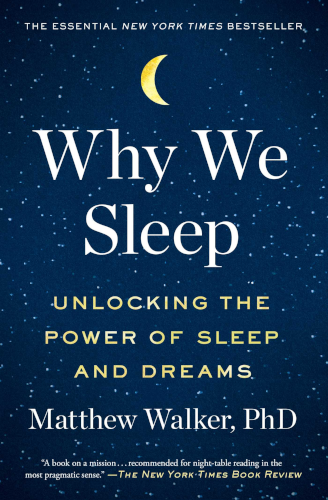

# Why We Sleep

By Matthew Walker

> > ---
> >
> > **Amazing Breakthrough!**
> >
> > Scientists have discovered a revolutionary new treatment that makes you live longer. It enhances your memory and makes you more creative. It makes you look more attractive. It keeps you slim and lowers food cravings. It protects you from cancer and dementia. It wards off colds and the flu. It lowers your risk of heart attacks and stroke, not to mention diabetes. You'll even feel happier, less depressed, and less anxious. Are you interested?
> >
> > ---
>
>  
>
> While it may sound hyperbolic, nothing about this fictitious advertisement would be inaccurate. If it were for a new drug, many people would be disbelieving. Those who were convinced would pay large sums of money for even the smallest dose.
>
> Of course, the ad is not describing some miracle new tincture or a cure-all wonder drug, but rather the proven benefits of a full night of sleep. [...] As for the prescription cost, well, there isn't one. It's free.
>
> [107]

 

If, after reading this, you'd be curious to learn how sleep accomplishes all this, and what we can do to get more higher-quality sleep, you've probably found the single best book in the world to answer those questions!

*Why We Sleep* compiles an absolute mountain of sleep data research and outlines the most interesting and valuable information about the benefits sleep provides and how we can optimize our own sleep. In my opinion, this is one of the most important books of our time.

### Sparks

> Routinely sleeping less than six hours a night weakens your immune system, substantially increasing your risk of certain forms of cancer. Insufficient sleep appears to be a key lifestyle factor linked to your risk of developing Alzheimer's disease. Inadequate sleep — even moderate reductions for just one week — disrupts blood sugar levels so profoundly that you would be classified as pre-diabetic. Short sleeping increases the likelihood of your coronary arteries becoming blocked and brittle, setting you on a path toward cardiovascular disease, stroke, and congestive heart failure. Sleep disruption further contributes to all major psychiatric conditions, including depression, anxiety, and suicidality.
>
> Perhaps you have also noticed a desire to eat more when you're tired? This is no coincidence. Too little sleep swells concentrations of a hormone that makes you feel hungry [ghrelin] while suppressing a companion hormone that otherwise signals food satisfaction [leptin]. Despite being full, you still want to eat more.
>
> Add the above health consequences up, and a proven link becomes easier to accept: relative to the recommended seven to nine hours, the shorter your sleep, the shorter your life span.
>
> [3]

 

> Society's apathy toward sleep has, in part, been caused by the historic failure of science to explain why we need it.
>
> [5]

Hence the title of this book.

 

> The longer you are awake, the more adenosine will accumulate. Think of adenosine as a chemical barometer than continuously registers the amount of elapsed time since you woke up this morning.
>
> [26]

You may hear this referred to as *sleep pressure*.

Caffeine blocks our adenosine receptors, making us not *feel* the pressure of
this adenosine buildup. Howver, it doesn't reverse or halt the adenosine accumulation itself.

 

> [On deep NREM sleep...]
>
> That default mode is what we call deep slow-wave sleep. It is an active, deliberate, but highly synchronous state of brain activity. It is a near state of nocturnal cerebral meditation, though I should note that it is very different from the brainwave activity of waking meditative states.
>
> [50]

 

> When it comes to information processing, think of the wake state principally as *reception*, NREM sleep as *reflection*, and REM sleep as *integration*.
>
> [52]

 

> Starve a fly and it will stay awake longer, demonstrating a pattern of food-seeking behavior. The same is true for humans. Individuals who are deliberately fasting will sleep less as the brain is tricked into thinking that food has suddenly become scarce.
>
> [66]

 

> The true pattern of biphasic sleep — for which there is anthropological, biological, and genetic evidence, and which remains measurable in all human beings to date — is one consisting of a longer bout of continuous sleep at night, followed by a shorter midafternoon nap.
>
> [69]

 

> Alcohol is one of the most powerful suppressors of REM sleep that we know of.
>
> [81]

And REM sleep is critically valuable to the health of our brains, especially to the neurological growth of a developing fetus.

 

> Administering caffeine to juvenile rats will also disrupt deep NREM sleep and, as a consequence, delay numerous measures of brain maturation and the development of social activity, independent grooming, and the exploration of the environment.
>
> [90]

This may make one think twice before giving caffeine to children or teenagers.

 

> Those older adults with the greatest loss of deep sleep showed the most catastrophic overnight forgetting. Poor memory and poor sleep in old are therefore not coincidental, but rather significantly interrelated.
>
> [101]

 

> Sleep is *the* universal health care provider: whatever the physical or mental ailment, sleep has a prescription it can dispense.
>
> [108]

 

> Sleep *before* learning refreshes our ability to initially make new memories. It does so each and every night.
>
> [109]

> The second benefit of sleep for memory comes *after* learning, one that effectively clicks the "save" button on those newly created files. In doing so, sleep protects newly acquired information, affording immunity against forgetting: an operation called consolidation.
>
> > It is a curious fact, of which the reason is not obvious, that the interval of a single night will greatly increase the strength of the memory... Whatever the cause, things which could not be recalled on the spot are easily coordinated the next day, and time itself, which is generally accounted one of the causes of forgetfulness, actually serves to strengthen the memory.
>
> [112]

 

> Other methods for amplifying the brainwaves of sleep are fast being developed. One technology involves quiet auditory tones being played over speakers next to the sleeper. Relative to a control group that slept but had no synchronous auditory chimes at night, the auditory stimulation increased the power of the slow brainwaves and returned an impressive 40 percent memory enhancement the next morning.
>
> [117]

 

> In a research study of competitive young athletes in 2014, a chronic lack of sleep across the season predicted a markedly higher risk of injury. Recent larger-scale analyses have confirmed the same relationship.
>
> [129]

 

> For now, I will simply tell you that such informational alchemy conjured by REM-sleep dreaming has led to some of the greatest feats of transformative thinking in the history of the human race.
>
> [132]

 

> Most worrying from a societal perspective were the individuals in the group who obtained six hours of sleep a night — something that may sound familiar to many of you. Ten days of six hours of sleep a night was all it took to become as impaired in performance as going without sleep for twenty-four hours straight.
>
> [136]

 

> *You do not know how sleep-deprived you are when you are sleep-deprived.*
>
> When participants were asked about their subjective sense of how impaired they were, they consistently underestimated their degree of performance disability.
>
> [137]

 

> The amygdala — a key hot spot for triggering strong emotions such as anger and rage, and linked to the fight-or-flight response — showed well over a 60 percent amplification in emotional reactivity in the participants who were sleep-deprived.
>
> [146]

 

> The striatum — associated with impulsivity and reward, and bathed by the chemical dopamine — had become hyperactive in sleep-deprived individuals.
>
> [147]

 

> There is no major psychiatric condition in which sleep is normal.
>
> [Of course, this does not imply a particular causal direction. He elaborates on the question of causality...]
>
> I firmly believe that sleep loss and mental illness is best described as a two-way street of interaction, with the flow of traffic being stronger in one direction or the other, depending on the disorder.
>
> [149]

 

> By regularizing and enhancing sleep, Harvey has stepped these patients back from the edge of crippling mental illness.
>
> [151]

 

> When we looked at this same brain structure in the sleep-deprived participants, we could not find any significant learning activity whatsoever. It was as though sleep deprivation had shut down their memory in-box, and any new incoming information was simply being bounced.
>
> Simply disrupting the depth of an individual's NREM sleep with infrequent sounds, preventing deep sleep and keeping the brain in shallow sleep, without waking the individual up will produce similar brain deficits and learning impairments.
>
> [154]

 

> Every major system, tissue, and organ of your body suffers when sleep becomes short. No aspect of your health can retreat at the sign of sleep loss and escape unharmed.
>
> [164]

 

> Many experiments over the past half century have investigated the impact of deficient sleep on the human body and typically observed an overactive sympathetic nervous system. For as long as the state of insufficient sleep lasts, and for some time thereafter, the body remains stuck in some degree of a fight-or-flight state.
>
> [167]

 

> In the Northern Hemisphere, the switch to daylight savings time in March results in most people losing an hour of sleep opportunity. Should you tabulate millions of daily hospital records, as researchers have done, you discover that this seemingly trivial sleep reduction comes with a frightening spike in heart attacks the following day.
>
> [169]

 

> Take it to the extreme by sleep-depriving an individual for twenty-four hours straight and they may only burn an extra 147 calories, relative to a twenty-four-hour period containing a full eight hours of sleep. Sleep, it turns out, is an intensely metabolically active state for brain and body alike.
>
> [175]

 

> When you are not getting enough sleep, the body becomes especially stingy about giving up fat. Instead, muscle mass is depleted while fat is retained.
>
> [178]

 

> The faces pictured after one night of short sleep were rated as looking more fatigued, less healthy, and significantly less attractive, compared with the appealing image of that same individual after they had slept a full eight hours. Sundelin had revealed the true face of sleep loss, and with it, ratified the long-held concept of "beauty sleep".
>
> [181]

 

> The less sleep an individual was getting in the week before facing the active common cold virus, the more likely it was that they would be infected and catch a cold. In those sleeping five hours on average, the infection rate was almost 50 percent. In those sleeping seven hours or more a night in the week prior, the infection rate was just 18 percent.
>
> [182]

 

> *Dreaming as Overnight Therapy*
>
> Cartwright demonstrated that it was only those patients who were expressly dreaming about the painful experiences around the time of the events who went on to gain clinical resolution from their despair, mentally recovering a year later as clinically determined by having no identifiable depression.
>
> [211]

 

> During the dreaming sleep state, your brain will cogitate vast swaths of acquired knowledge, and then extract overarching rules and commonalities — "the gist". We awake with a revised "Mind Wide Web" that is capable of divining solutions to previously impenetrable problems. In this way, REM-sleep dreaming is informational alchemy.
>
> [219]

 

> Compared to reading a printed book, reading on an iPad suppressed melatonin release by over 50 percent at night. Indeed, iPad reading delayed the rise of melatonin by up to three hours.
>
> But did reading on the iPad actually change sleep quantity/quality above and beyond the timing of melatonin? It did, in three concerning ways. First, individuals lost significant amounts of REM sleep following iPad reading. Second, the research subjects felt less rested and sleepier throughout the day following iPad use at night. Third was a lingering aftereffect, with participants suffering a ninety-minute lag in the evening rising melatonin levels for several days after iPad use ceased.
>
> Perhaps more that the blue light itself, research from Flinders University suggests that the harmful impact of evening smartphone and laptop use on sleep is due to a significant alerting effect.
>
> [269]

So what's the worst thing you can do in the evening hours before going to bed? Get on your smartphone, open up a social media app that bombards you with attention-grabbing flashy images and videos, and watch a dozen video shorts all designed to spike your levels of excitement and saturate your senses with stimulus.

 

> Many individuals believe alcohol helps them to fall asleep more easily, or even offers sounder sleep throughout the night. Both are resolutely untrue.
>
> Sedation is not sleep. Alcohol sedates you out of wakefulness, but it does not induce natural sleep. The electrical brainwave state you enter via alcohol is not that of natural sleep; rather, it is akin to a light form of anesthesia.
>
> [271]

 

> Researchers recruited a large group of college students for a seven-day study.
>
> On day 1, all the participants learned a novel, artificial grammar, rather like learning a new computer coding language or a new form of algebra. Everyone learned the new material to a high degree of proficiency on that first day — around 90 percent accuracy. Then, a week later, the participants were tested to see how much of that information had been solidified by the six nights of intervening sleep.
>
> In the first group, participants were allowed to sleep naturally and fully for all intervening nights. In the second group, the experimenters got the students a little drunk just before bed on the first night after daytime learning. In the third group, they allowed the participants to sleep naturally on the first and even the second night after learning, and then got them similarly drunk before bed on night 3.
>
> Note that all three groups learned the material on day 1 while sober, and were tested while sober on day 7.
>
> On day 7, participants in the control condition remembered everything they had originally learned, even showing an enhancement of abstraction and retention of knowledge relative to initial levels of learning.
>
> The real surprise came in the results of the third group of participants. Despite getting two full nights of natural sleep after initial learning, having their sleep doused with alcohol on the third night still resulted in almost the same degree of amnesia [as the second group] — 40 percent of the knowledge they had worked so hard to establish on day 1 was forgotten.
>
> [273]

The lesson: *Alcohol and learning don't mix.*

Flip this study around and you get the following result: If you get slightly drunk before bed tonight, you delete *half of everything you've learned* over the past *many days* from your brain. (We don't know how many is "many", but it's at least three days, and likely the effect reaches back at least a week in some capacity...)

 

> To successfully initiate and maintain sleep into the night, as described in chapter 2, your core temperature needs to decrease by 2 to 3 degrees Fahrenheit, or about 1 degree Celsius. For this reason, you will always find it easier to fall asleep in a room that is too cold than too hot.
>
> [275]

> A bedroom temperature of around 65 degrees Fahrenheit (18.3 degrees Celsius) is a reasonable goal for the sleep of most people, assuming standard bedding and clothing.
>
> [277]

 

> When you get out of the [hot] bath, those dilated blood vessels on the surface quickly help radiate out inner heat, and your core body temperature plummets. Consequently, you fall asleep more quickly because your core is colder. Hot baths prior to bed can also induce 10 to 15 percent more deep NREM sleep in healthy adults.
>
> [279]

 

> No past or current sleeping medications on the legal (or illegal) market induce natural sleep.
>
> [281]

 

> A recent team of leading medical doctors and researches examined all published studied to date on newer forms of sedative sleeping pills that most people take. Overall, participants subjectively felt they fell asleep faster and slept more soundly with fewer awakenings, relative to the placebo. But that's not what the actual sleep recordings showed. There was no difference in how soundly the individuals slept. Both the placebo and the sleeping pills reduced the time it took people to fall asleep, but the change was not statistically different between the two.
>
> In other words, there was no objective benefit of these sleeping pills beyond that which a placebo offered.
>
> [285]

 

> There are already numerous and effective behavioral methods for improving your sleep.
>
> The obvious methods involve reducing caffeine and alcohol intake, removing screen technology from the bedroom, and having a cool bedroom. In addition, (1) establish a regular bedtime and wake-up time, even on weekends, (2) go to bed only when sleepy and avoid sleeping on the couch early/mid-evenings, (3) never lie awake in bed for a significant time period; rather, get out of bed and do something quiet and relaxing until the urge to sleep returns, (4) avoid daytime napping if you are having difficulty sleeping at night, (5) reduce anxiety-provoking thoughts and worries by learning to mentally decelerate before bed, and (6) remove visible clock-faces from view in the bedroom, preventing clock-watching anxiety at night.
>
> [291]

 

> Eating a high-carbohydrate, low-fat diet for two days decreases the amount of deep NREM sleep at night, but increases the amount of REM sleep dreaming, relative to a two-day diet low in carbohydrates and high in fat.
>
> A four-day diet high in sugar and other carbohydrates, but low in fiber, resulted in less deep NREM sleep and more awakenings at night.
>
> [295]

 

> Under-slept employees are not only less productive, less motivated, less creative, less happy, and less effective, but they may be more unethical.
>
> Studies in the workplace have found that employees who sleep six hours or less are significantly more deviant and more likely to lie the following day.
>
> The less an individual sleeps, the more likely they are to create fake receipts and reimbursement claims, and the more willing to lie to get free raffle tickets. Barns also discovered that under-slept employees are more likely to blame other people in the workplace for their own mistakes, and even try to take credit for other people's successful work.
>
> [301]

 

> The unfortunate study participants spent the entire time in the laboratory with electrodes placed on their heads. At night, whenever they entered into the REM-sleep state, a research assistant would quickly enter the bedroom and wake the subjects up. NREM sleep was left largely intact, but the amount of REM sleep was reduced to a fraction of its regular quantity.
>
> It didn't require all seven nights of dream-sleep deprivation before the mental health effects began to manifest. By the third day, participants were expressing signs of psychosis.
>
> Only then did scientists realize the rather profound conclusions of the experiment: REM sleep is what stands between rationality and insanity.
>
> [309]

 

> [On the detriments of excessively early school start times, and the benefits of shifting the start time later...]
>
> [With a school start time of 7:25 a.m.], the average verbal SAT scores of the top-performing students was a very respectable 605. The following year, after switching to an 8:30 a.m. start time, that score rose to an average 761 for the same top-tier bracket of students.
>
> [311]

 

> When sleep is abundant, minds flourish. When it is deficient, they don't.
>
> [316]

 

> One practice known to convert a healthy new habit into a permanent way of life is exposure to your own data. Research in cardiovascular disease is a good example. If patients are given tools that can be used at home to track their improving physiological health in response to an exercise plan, compliance rates increase.
>
> [328]

In lieu of fancy medical devices, I have found it incredibly informative to have a simple baseline physical activity that I do regularly, which I can use as a benchmark. For example, suppose every day I get up and run the same two-mile trail by my house. I'll start to get a feel for what it "normally" feels like. (I can also get an objective metric from the duration of the run.)

Once I have this baseline, it becomes very easy and obvious to tell if I'm in significantly better or poorer condition than "normal" on a particular day. If this is the case, I look back over the events of the past couple days, think about what I can learn, and update my behavior accordingly.

When the data is staring you in the face — you're panting and struggling halfway through a run that's normally easy — it becomes impossible to ignore.

 

> *Twelve Tips for Healthy Sleep*
>
> 1. Stick to a sleep schedule. Go to bed and wake up at the same time each day.
> 2. Exercise is great, but not too late in the day. Try to exercise at least thirty minutes on most days, but not later than two to three hours before your bedtime.
> 3. Avoid caffeine and nicotine.
> 4. Avoid alcoholic drinks before bed.
> 5. Avoid large meals and beverages late at night.
> 6. Avoid medications that delay or disrupt your sleep.
> 7. Don't take naps after 3 p.m.
> 8. Relax before bed. [*Not* by looking at a screen.]
> 9. Take a hot bath before bed.
> 10. Dark bedroom, cool bedroom, gadget-free bedroom.
> 11. Have the right sunlight exposure. Try to get outside in natural light for at least thirty minutes each day [ideally in the morning]. Turn down the lights before bedtime.
> 12. Don't lie in bed awake. Get up and do some relaxing [boring] activity until you feel sleepy.

 

---

 

Return to the [Book List](Readme.md#book-list).
